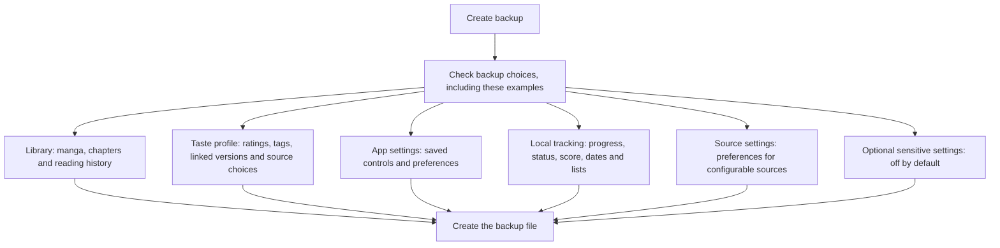
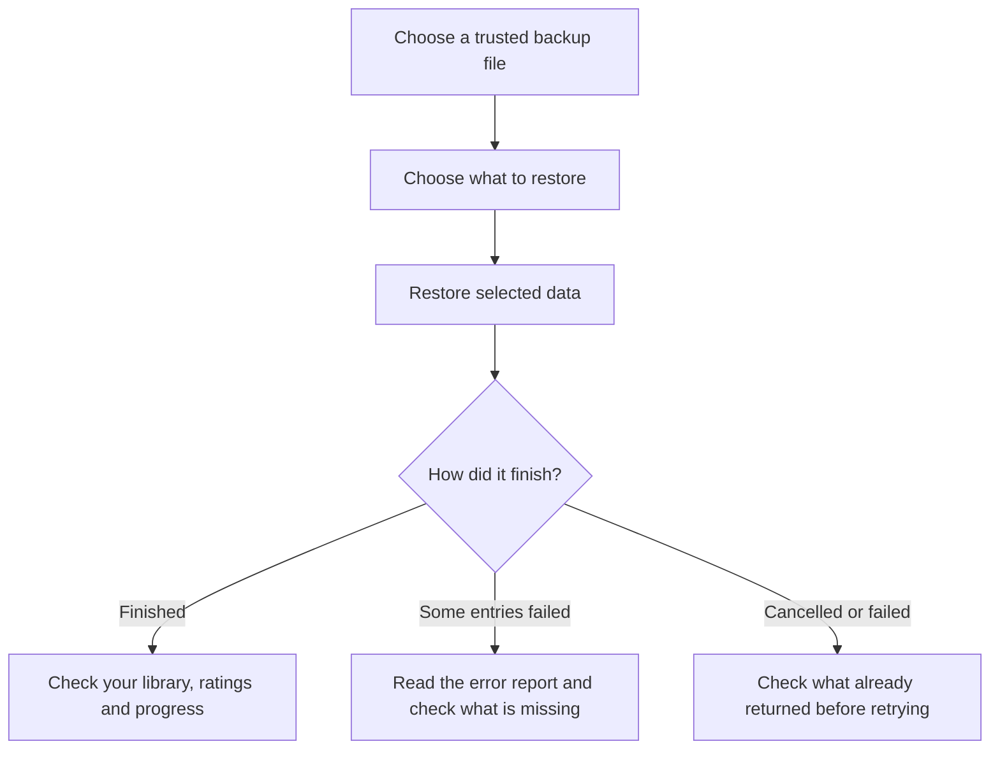
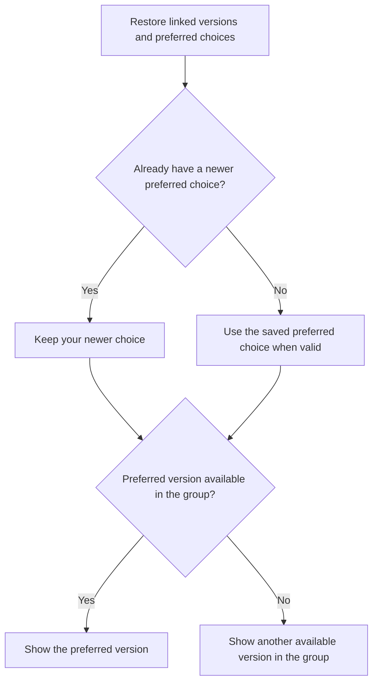
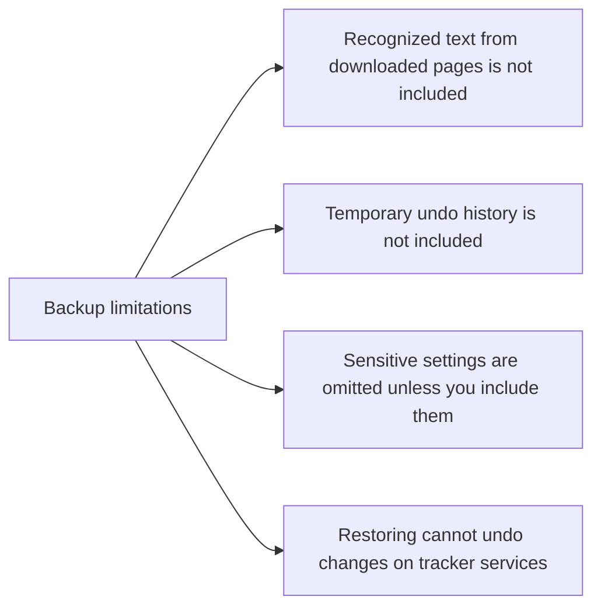

# Back up and restore your library

Use Komikku's normal backup screen to save your library together with Komikku FC ratings, recommendation choices, linked versions, and local reading progress. You choose what to include and what to restore.

## Where you find it

Open **Settings > Data and storage**, then use Komikku's backup or restore actions. Komikku FC data appears inside the supported backup categories rather than through a separate backup screen.

## What Komikku FC adds to a backup

Use the app's normal backup actions to choose a file location or schedule. Alongside library data, a backup can include your ratings, recommendation settings, linked manga versions and preferred versions, source-quality choices, and evaluation results.

Check these options before creating the file:

| Option | What it saves |
| --- | --- |
| Taste profile | Your manga ratings, tag preferences and alternate tag names, disabled recommendation sources, linked versions, preferred versions, saved For You focus modes, source-quality choices, and saved alternate-source pairs and chapter matches. |
| Local tracking | Local reading status, last-read chapter, score, dates, lists, linked source entries, and each version's saved progress and choice about sharing progress. |
| App settings | App preferences, including recommendation controls stored as settings. Select this as well as Taste profile if you want those controls back. |
| Source settings | Settings belonging to your installed configurable sources. |
| Include sensitive settings | Optional private settings, such as tracker sign-in details. This is off by default; leave it off unless you need those details in the backup. |

For a backup of linked reading progress, include **Taste profile** and **Local tracking**, along with the library and chapter data you want to keep. These are separate choices: saving ratings does not automatically save local tracking. A backup does not undo changes on a tracker website or other outside service.

## How to interpret a restore result

Choose your backup file, then select the categories you want to restore. Read the completion message and any error report before assuming everything returned. A restore can finish with some entries missing or unsuccessful. Cancelling stops the remaining work; it does not undo entries already restored.

Older backups cannot restore fields that they never saved. After restoring, check your ratings, linked versions, preferred version, and local chapter progress. You may also need to reinstall a source extension or sign in again.

## Protect your backup

Keep the backup somewhere you trust. It can reveal your library, ratings, reading preferences, and any sensitive settings you chose to include. Hiding the saved location in a settings summary does not encrypt the file or make it safe to share publicly. Restore only backups you trust, and create a fresh backup before restoring over your current data.

## Backup selection

Komikku FC data uses the existing backup format and appears as clear backup options. It does not create a second kind of archive.

## Restore and check the result

The restore result includes the selected Komikku FC data. An error report means you should check the affected entries before trying again.

## Preferred versions after restoring

For a linked group, a newer preferred-version choice already on your device is kept instead of being replaced by an older backup choice. Invalid saved choices can be ignored. If the preferred version is missing from the group, the app can show another available version; that does not migrate your manga to another source.

## What a backup does not save

You can rebuild recognized page text from your downloads. You may need to sign in to outside services again after restoring.

Downloaded page images, recognized page text, and temporary Action History entries are not included. Back up your download folder separately if you want to keep its files. Outside-service changes are not restored or undone. Sign-in details depend on the sensitive-settings option, so do not assume every backup excludes them.

See [Local tracking](local-tracking.md) for shared chapter progress and [Ratings](ratings.md) for linked groups and preferred versions.
