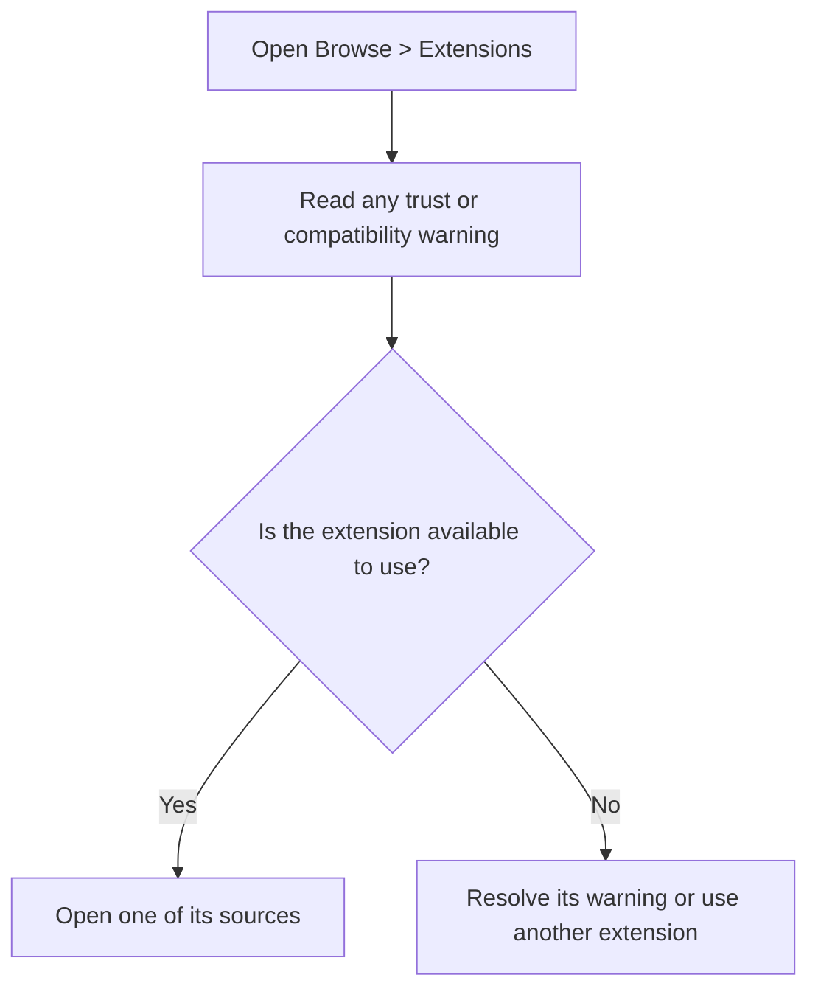
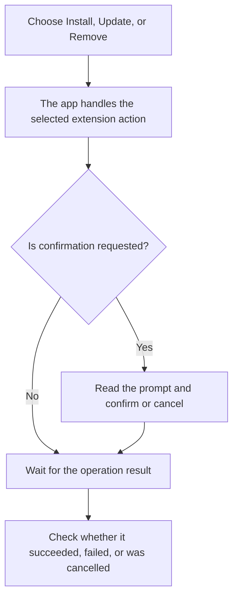
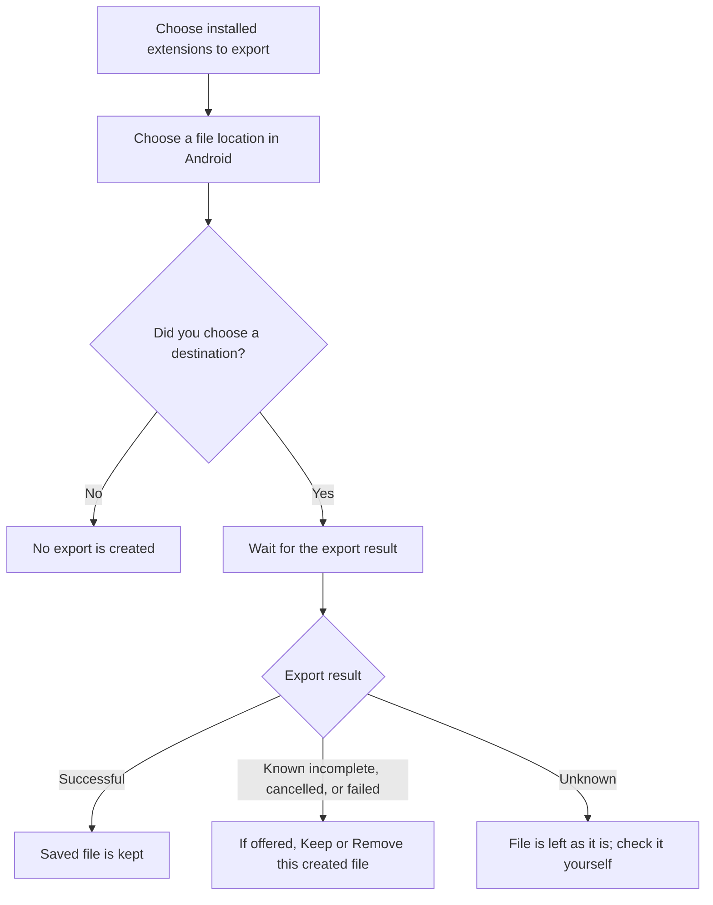
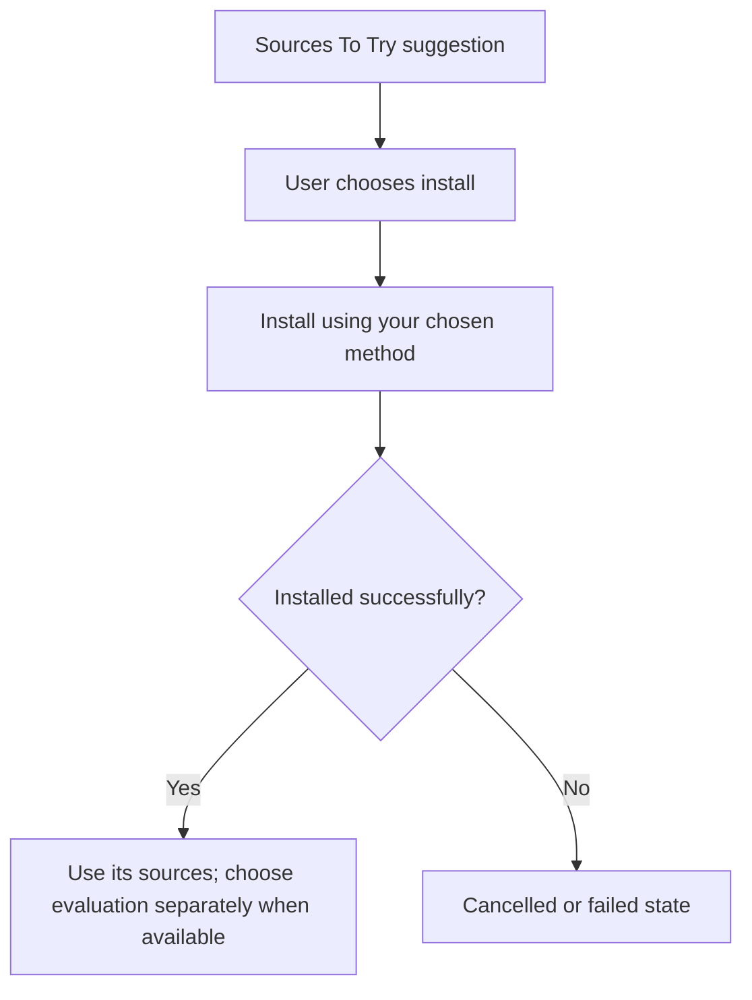

# Managing extensions

Extensions connect Komikku FC to manga sources. Install only extensions you trust. Installing an extension, trusting it, and choosing a source for recommendations are different actions.

## Where you find it

Open **Browse > Extensions** for installed and available extension actions. **Sources To Try** also lets you choose suggested extensions to install using your selected installation method.

## Installation and trust

Choose an install or update action to get an extension. The extension installer setting controls how it is installed: private installation keeps it within the app, while other supported methods may install it as an Android package or require extra setup. Android confirmation prompts depend on the method and permissions; they do not appear for every operation.

Open **Settings > Advanced > Extensions > Extension installer** to choose the method for ordinary extension installs. Choose from the methods offered by your build; private installation is not offered in public builds. Shizuku requires separate setup, and selecting it without Shizuku installed shows a warning rather than switching the installer.

The installer choice inside **Source Evaluation** applies to that evaluation, not this general preference. Changing either installer choice does not install an extension by itself. See [Source Evaluation](source-evaluation.md) for its installation and cleanup warnings.

| Action | What it means | What to check |
| --- | --- | --- |
| Install or update | Get the selected extension using your installer choice. | Read any permission, trust, or compatibility warning. |
| Trust | Allow an untrusted installed extension to load. | Verify its origin before accepting; trust is not a safety guarantee. |
| Remove | Remove the selected extension. | Its sources may no longer load manga; do not confuse removal with deleting library manga. |
| Export | Save a copy of installed extension files. | Check what you are sharing and whether you have permission to distribute it. |
| Evaluate | Check a source's recommendation fit. | Installation success alone does not mean the source is a good match or safe. |

Installed package names, repositories, and configured sources can identify a user's setup. The workflow does not require sharing a personal extension list.

## If an extension cannot load

One incompatible extension does not mean every other extension is unusable. Check the affected extension's warning rather than repeatedly retrying its manga. See [Safety](safety.md) and [Troubleshooting](troubleshooting.md).

## Install and remove

Do not assume the operation succeeded just because you pressed its button. A cancelled or failed installation is not an installed extension. Supported action-history entries are not a backup of extension files or a guarantee that every package action can be undone.

## Exported-file cleanup

Export copies an already-installed extension file without modifying or re-signing it. A multiple-extension archive also includes extension names, versions, package identifiers, signatures, and repository information. It does not contain your library or tracker account data. Evaluation mode does not hide these details inside the export.

Public builds keep successful exports. If your build also offers **Keep** or **Remove** after success, that is a separate choice, not automatic deletion. Cleanup targets only the file created by this export. Failed removal leaves the file in place. See [Sharing](sharing.md) for incomplete files, cancellation, and unknown results.

## Continue to Source Evaluation

Sources To Try lets you choose suggested extensions to install. A suggestion is not a guarantee about its content, availability, or quality. After installation, review its sources and choose [Source Evaluation](source-evaluation.md) separately when you want to check recommendation fit.

Keep your extension list private unless you intend to share it: names and repositories can identify your reading setup.
