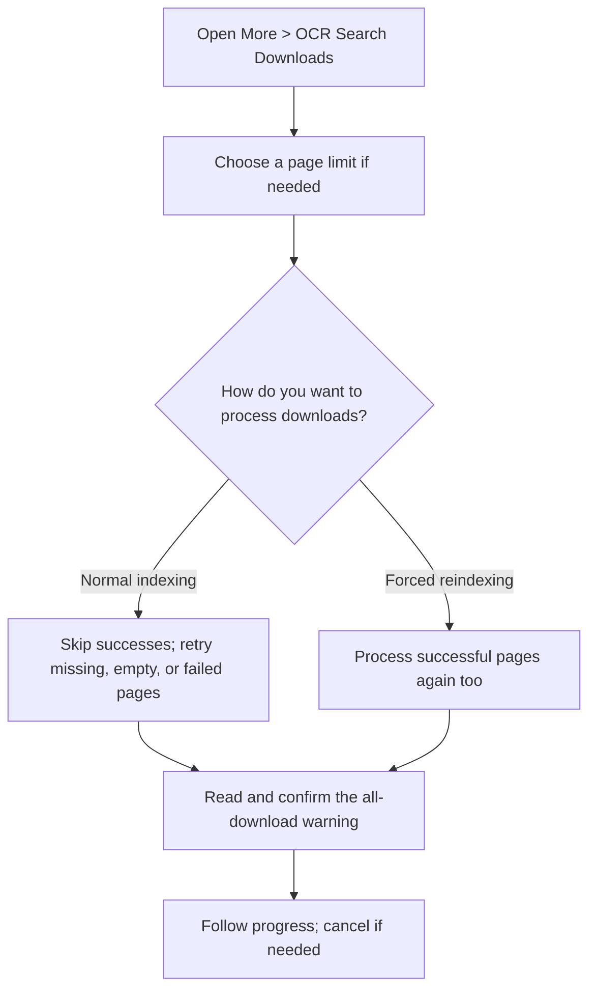
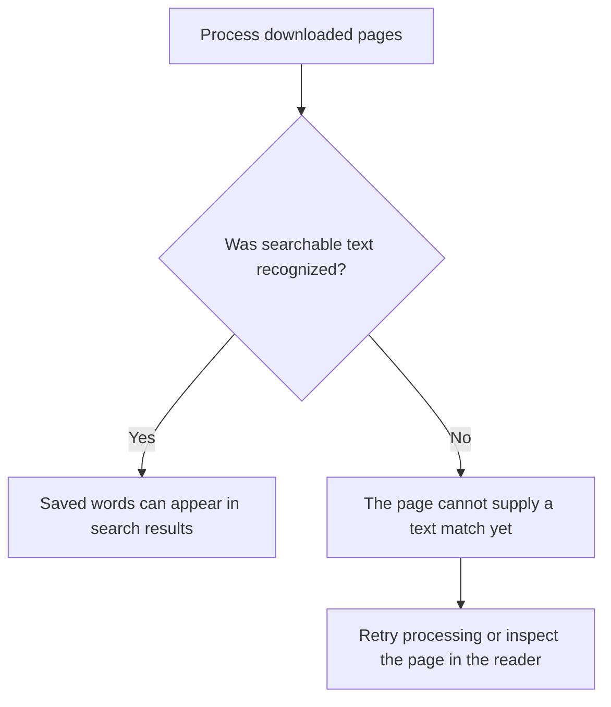
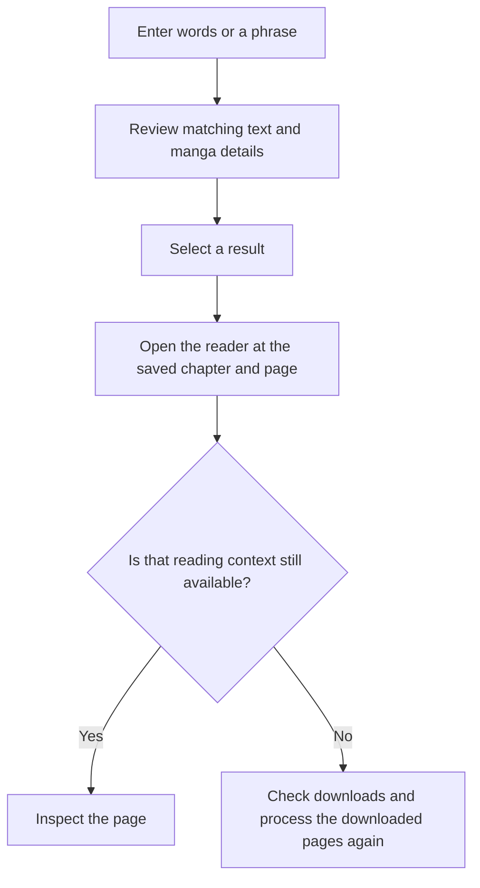
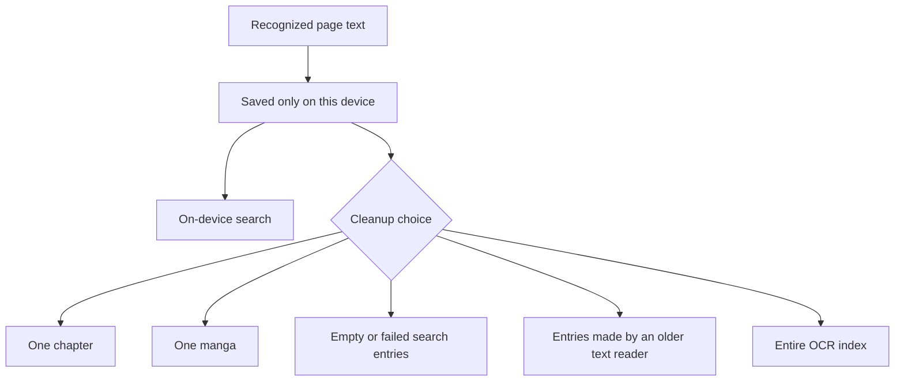

# Search text in downloaded pages

**OCR Search Downloads** reads text from downloaded manga pages and saves it for searching on your device. Use it to find a phrase inside a page, not just a manga title. OCR means recognizing text in an image; it can misread words or miss them entirely.

## Where you find it

Open **More > OCR Search Downloads**. The search screen lets you process all downloaded manga, choose a page limit, search recognized text, and clear saved search text.

## What OCR Search Downloads is for

First process your downloads, then enter the words you want to find. Processing can take time, storage, and battery. The current text reader uses Latin-script recognition, so do not expect reliable results for every language, unusual lettering, or low-quality image.

Only downloaded pages are processed. This feature does not fetch every remote chapter or upload your page images for recognition. A page with no recognized text cannot provide a search match, even if the image contains words you can see.

## Choose how much to process

Use normal indexing to process missing pages and retry empty or failed results while skipping pages already processed successfully. Forced reindexing processes pages again, including successful ones. Both all-download actions ask for confirmation.

Choose **Unlimited**, 50, 100, 250, or 500 pages. The limit applies to the downloaded pages considered before already-successful pages are skipped, not just new recognition attempts. It is not a per-manga allowance. Repeating a limited run does not necessarily advance to the next set of pages; increase the limit or choose Unlimited to include more downloads. A limited or cancelled run can leave some downloads unprocessed.

## Work, cancellation, and results

Processing runs in the background because a large download library can take time and battery. Cancelling stops further work; it does not mean processing finished. Successfully saved search text remains usable after a partial run. You can run processing again or clear that text.

Search puts stronger word matches above partial matches. Select a result to open the reader at its saved manga, chapter, and page. If the manga, chapter, or downloaded page has changed or disappeared, opening it can fail. Check your downloads and process the downloaded pages again rather than assuming the old result still points to an available page. Ordinary reader use can update reading progress.

## Before sharing a result

Result cards can show recognized page text, manga and chapter titles, source names, and page numbers. These can reveal what you read. Evaluation mode can hide supported source labels, but not manga titles or recognized text. Inspect the whole screenshot before sharing it; see [Sharing](sharing.md).

## Entry and indexing

Leaving the screen does not itself cancel the background run. Android can still stop work; do not assume every download was processed just because you left it running.

## Page processing

Empty or failed results do not prove the page has no words. Check the image and recognition limits before retrying a large run.

## Search and navigation

Stronger word matches appear higher in the results. A result is a saved reference, not a guarantee that its page is still available.

## Privacy and cleanup

The index is local and can be rebuilt. Cleanup changes only the search index and does not delete downloaded page files.

Recognized text remains on the device and is excluded from Komikku FC backup and sync. Cleanup removes the search index, not manga pages or downloaded files.
