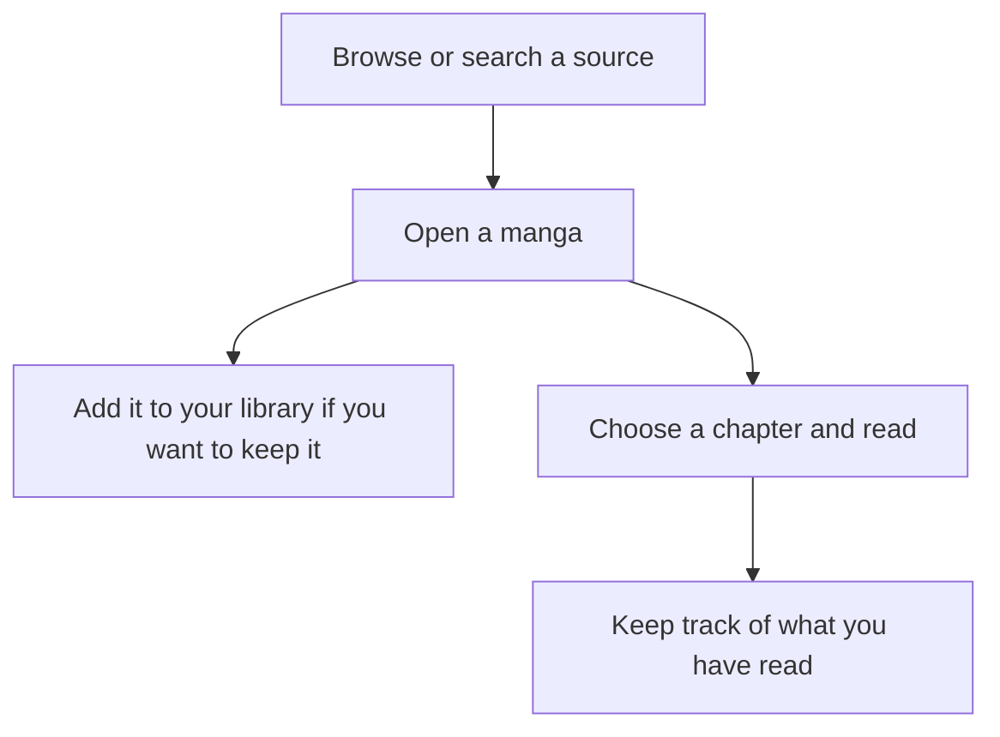
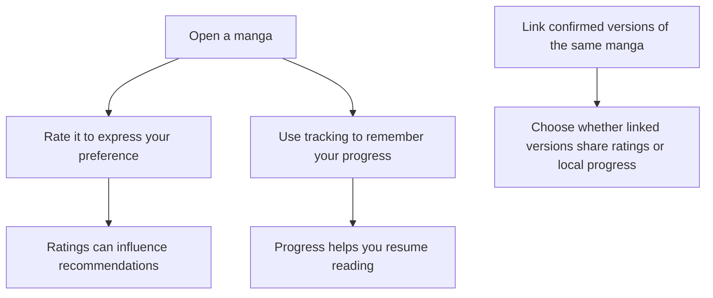
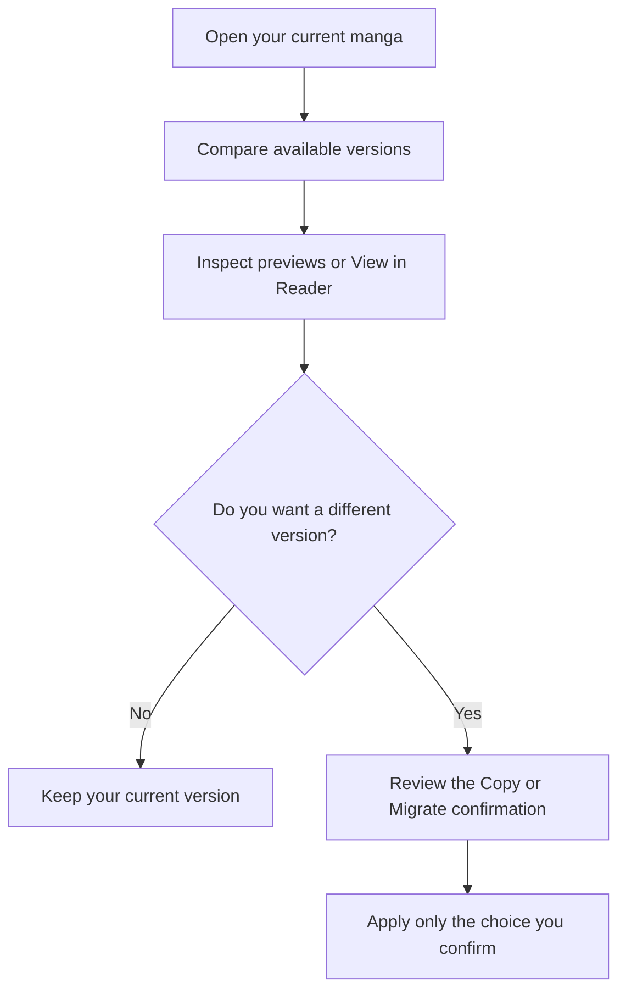
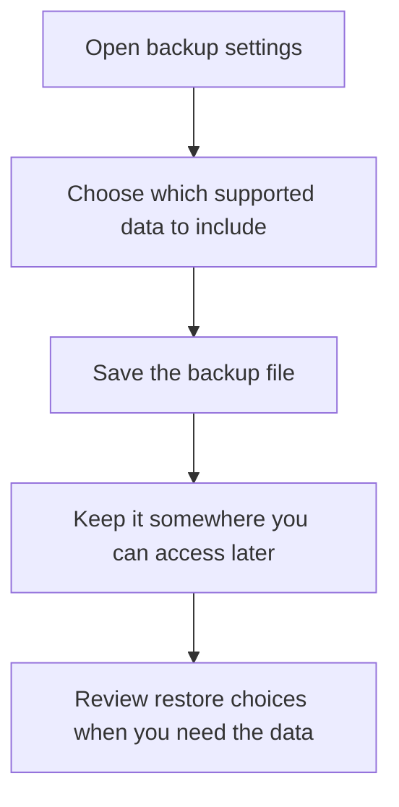
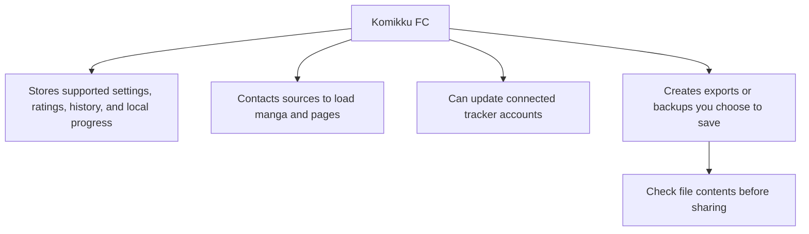

# How Komikku FC features work together

Komikku FC is an independent Android manga reader based on Komikku. It keeps the familiar library, reader, downloads, and backups, and adds tools for recommendations, linked manga versions, local tracking, page-text search, and optional reading limits.

## Choose the guide you need

- [Recommendations](recommendations.md): find manga based on your preferences.
- [Recommendation settings](recommendation-settings.md): change filters and recommendation choices.
- [Ratings](ratings.md): rate manga and manage linked versions.
- [Local tracking](local-tracking.md): remember chapter progress without a tracker account.
- [Versions](versions.md): compare the same manga from different sources.
- [Reading](reading.md): use reader controls and switch between sources.
- [Source Evaluation](source-evaluation.md): check source fit and search compatibility.
- [Sources](sources.md) and [Extensions](extensions.md): find and manage places to read.
- [Page-text search](ocr.md): search text extracted from manga pages.
- [Backups](backups.md): save and restore supported app data.
- [Sharing](sharing.md), [Safety](safety.md), and [Troubleshooting](troubleshooting.md): review privacy, permissions, and problems.

## Start with your manga

An extension connects the app to a manga source. That source supplies its own titles, chapter lists, and pages. What is available can differ between sources, and a source can be temporarily unavailable.

## Ratings and progress are different

A rating tells the app what you think of a manga. Tracking remembers your chapter progress. Settings can start local tracking when you rate a manga or share progress across confirmed linked versions, but these are separate choices. Linking versions does not mean copying all library data or changing external tracker accounts.

## Compare before changing versions

Different sources can offer different translations, chapter numbering, or image quality. Comparing previews or opening a candidate in the reader does not automatically migrate your library entry. Read the confirmation choices before copying or migrating data.

## Save data before making large changes

A backup contains the data selected in the backup options, not every file or account detail on your device. Downloaded chapter images need separate handling. Restoring is not an undo button for everything you have done, including changes on external services.

See [Backups](backups.md) for sensitive-data options, merge behavior, and restore limits. Before installing an update, read its release notes and use the correct build for your installed app. This guide does not promise that every older installation can automatically discover a new fork release.

## Know what is shared

Recommendations do not require a separate Komikku FC recommendation account. That does not make all app activity offline: installed sources receive requests for manga and pages, connected trackers can receive updates, and exports or backups can contain personal reading information.

**Evaluation mode** hides supported identifying labels on screen only. It does not hide manga titles or artwork, sanitize exported files, or change the source an action uses. Check screenshots and files yourself before sharing them.

## Read What's New

The in-app **What's New** history explains Komikku FC feature changes separately from Komikku's upstream release information. Open older sections when you want to review previous changes. Reading or acknowledging the history is not the same as downloading or installing an update.
