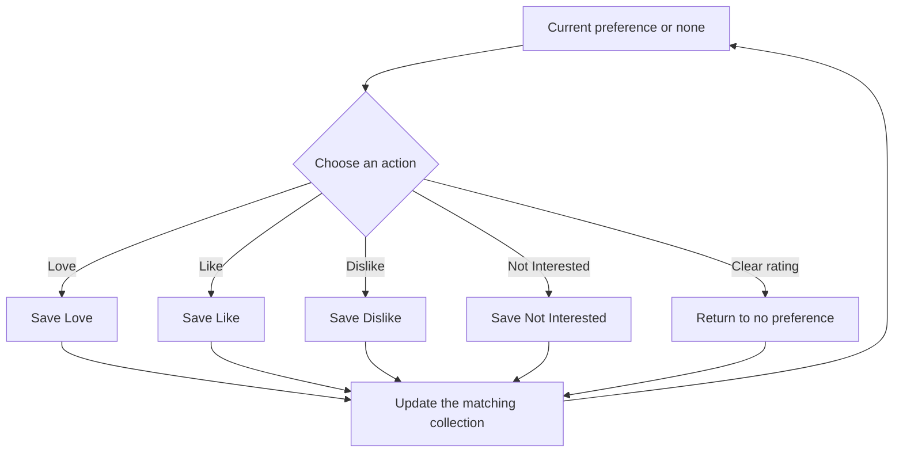
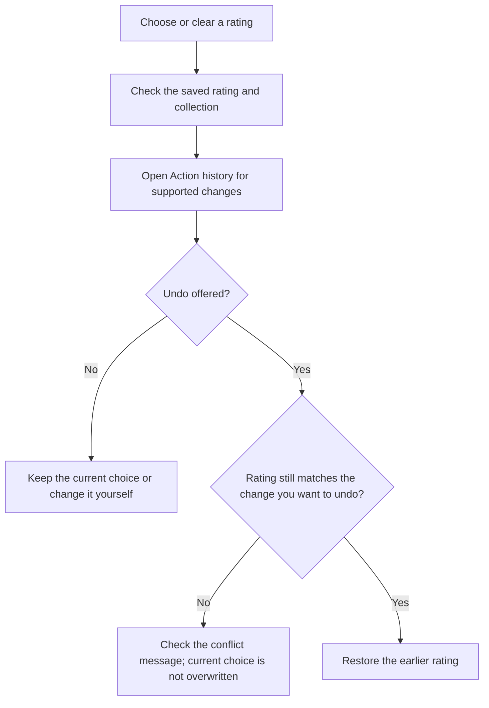
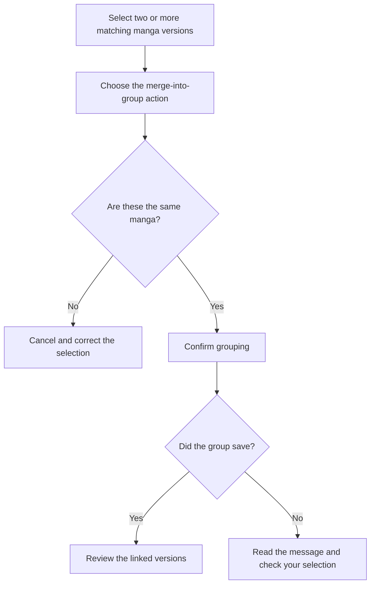
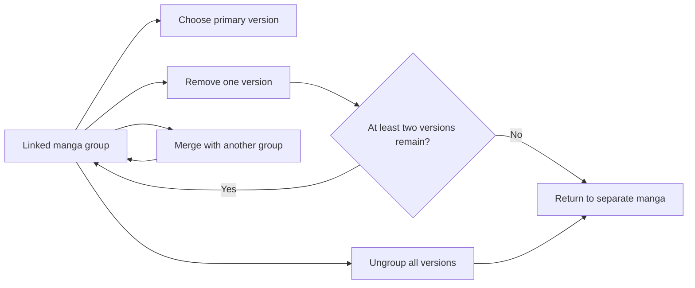
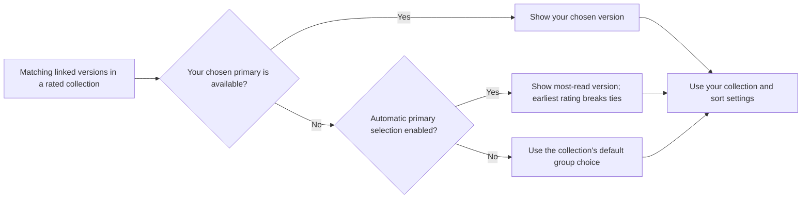

# Rating manga and managing linked versions

Save how you feel about a manga with Love, Like, Dislike, or Not interested. You can revisit those choices, change them, and keep matching versions from different sources together.

## Where you find it

On a manga page, choose **Love**, **Like**, **Dislike**, or **Not interested**. The For You menu opens each collection. When versions are linked, you can choose which matching versions should receive the same preference.

## Choose or clear a rating

Each manga has one current rating. Choosing Like after Love replaces Love; choosing Not interested replaces the previous rating too. **Clear rating** removes the choice and returns the manga to an unrated state. Not interested has its own collection and visible marker, just like the other choices.

Open the Loved, Liked, Disliked, or Not interested collection from For You to review your choices. A manga appears in the collection for its current rating. Linking versions does not merge their chapter lists or make them a single library entry.

## Settings that affect rating

| Setting | What it does |
| --- | --- |
| Rate linked versions together | Setting or clearing a rating can also apply to confirmed versions of the same manga from other sources that you track locally. Turn it off when you want to rate them separately. |
| Start tracking when you rate a manga | Starts local tracking when you save Love, Like, or Dislike. Not interested does not start tracking this way. This does not turn on updates to outside tracker accounts. |
| Track linked versions together | Lets other confirmed versions join local tracking when one version is tracked. This is separate from giving those versions the same rating. |
| Ask for a rating after finishing | Offers a rating after you finish the latest available chapter. You do not have to rate it. |
| Ask about other versions | After the reader rating prompt, offers a separate choice about giving that rating to other versions. Cancelling that follow-up does not undo the rating you already saved. |
| Use top-right rating actions | Changes whether rating actions are in the top-right menu or on each rated manga card. |
| Choose a primary version automatically | Chooses the entry shown for a linked group when you have not chosen one yourself; see below. |

The recommendation settings contain the linked-version, prompt, action-placement, and automatic-primary controls. **Start tracking when you rate a manga** is in Tracking settings. See [Recommendation settings](recommendation-settings.md) and [Local tracking](local-tracking.md) for the related controls.

These choices work separately. When you set or clear a rating, **Rate linked versions together** includes confirmed linked versions that are already tracked locally at that point. A newly discovered or untracked version is not automatically given that rating just because its title matches.

After you save Love, Like, or Dislike, **Start tracking when you rate a manga** can create local tracking. **Track linked versions together** can then attach other confirmed versions to that tracking. Attaching them does not, by itself, give them the rating you just saved; a later rating action can include them once they are tracked, or you can explicitly choose them through **Find other versions**. Turning off linked tracking prevents those automatic attachments, but it does not stop your current version from starting tracking when the separate start-tracking setting is on. Turning off automatic creation also does not stop sharing an existing tracker when linked tracking is on.

Clearing a rating removes the selected rating, including from the eligible tracked linked versions when rating sharing is on. It does not delete local tracking or erase chapter progress. Versions that have not been confirmed as the same manga still need your explicit selection.

## What Action History can restore

After a supported rating change, open **Action history** and use **Undo** if it is offered. The app checks for later changes before restoring the earlier choice. If you changed the rating again, Undo may report a conflict rather than overwrite your newer rating.

Undoing a local rating is not a promise to undo changes on a tracker website, reinstall extensions, or restore every related reading-progress change. Check the action shown in the history screen.

## Linked-version behavior

Linked versions are entries for the same manga from different sources, not different releases of the app. Use **Linked versions** to inspect them and **Manage group** to change the group. Check that the entries really are the same manga before combining them.

To combine entries, select two or more matching versions in a rated collection, choose the merge-into-group action, and review the confirmation. Cancel if the selection is wrong. You can also select all entries in a group, remove selected entries from a group, or ungroup it. Removing a version from a group does not clear its rating or delete its manga data.

**Find other versions** searches for matching entries. **Favorite other versions** is a separate library action, not the setting that chooses the displayed primary. You can also request recommendations from one version or from the linked group.

## Which version represents a group?

The primary version is the manga entry whose title and cover represent a linked group in a rated collection. It is not a different app version, does not add other versions to your library, and does not move chapters between sources.

With **Choose a primary version automatically** enabled in the recommendation settings, the app prefers the linked version with the most chapters marked read. If several versions have the same count, it prefers the one rated first. This is a useful starting point, not a judgment about which translation is best.

Choosing a primary version yourself takes precedence over that automatic choice while your chosen version is available in the collection. Turn the setting off if you do not want reading counts to decide the default. Removing a version or making its source unavailable can require the group to display another available member.

To manage chapter progress separately, see [Local tracking](local-tracking.md). Rating and selecting a primary version do not, by themselves, turn on updates to outside tracker accounts.

## Preference states

Every choice replaces the previous preference in one action. Not Interested is saved in the same way as Love, Like, and Dislike, and clearing a preference returns the manga to no preference.

## Change a rating and revisit it

Only supported saved changes can have an Undo action. Read any failure or conflict message; a message about one action does not mean every related setting or progress change was reversed.

## Create or merge a group

The app asks for confirmation before combining separate versions or existing groups.

## Maintain a group

With fewer than two versions, the rated collection no longer shows a multi-version group. Removing a version or ungrouping does not clear its rating.

## Grouped display

Collections come from the saved preferences and linked versions, so they stay consistent across screens.

Not interested is a full preference with its own collection and marker. It can be changed or cleared like the other choices, and supported local changes can be undone from Action History when nothing newer has replaced them.
