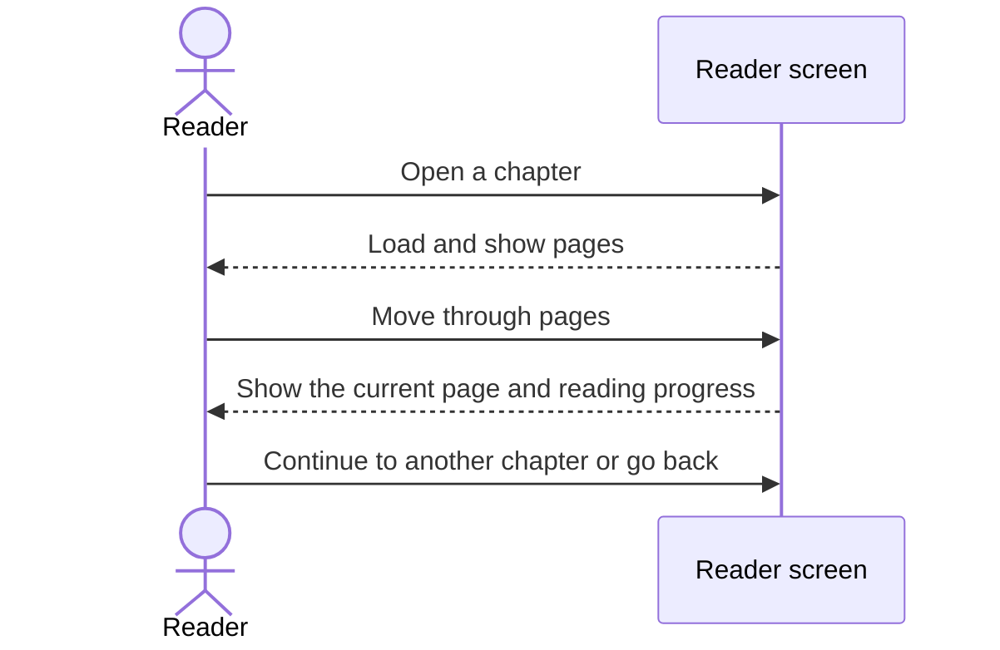
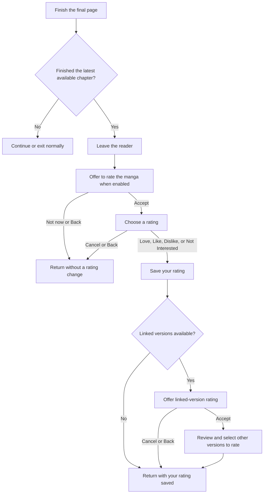
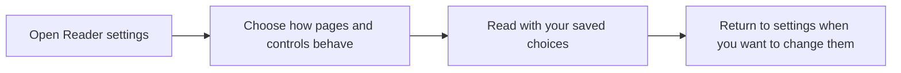
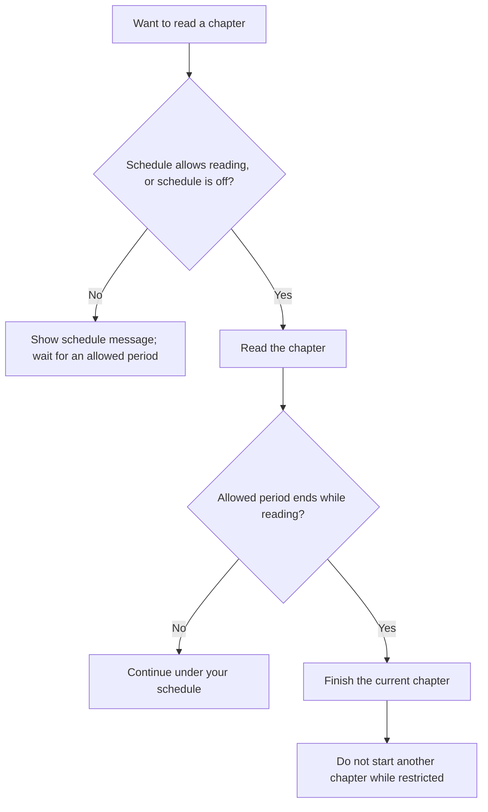
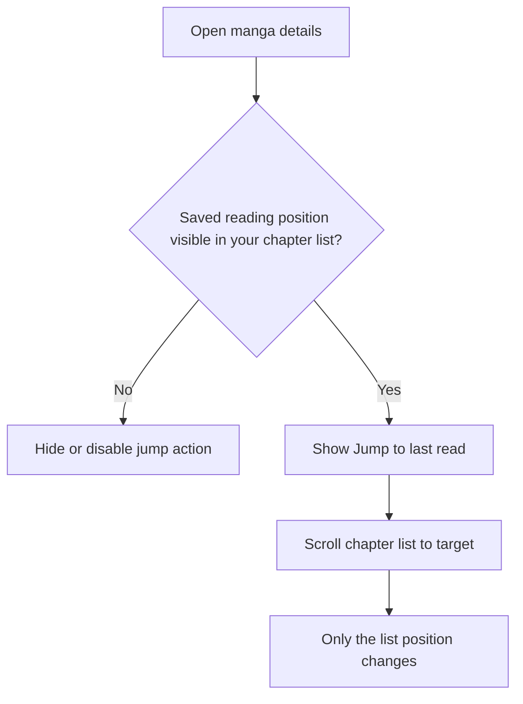
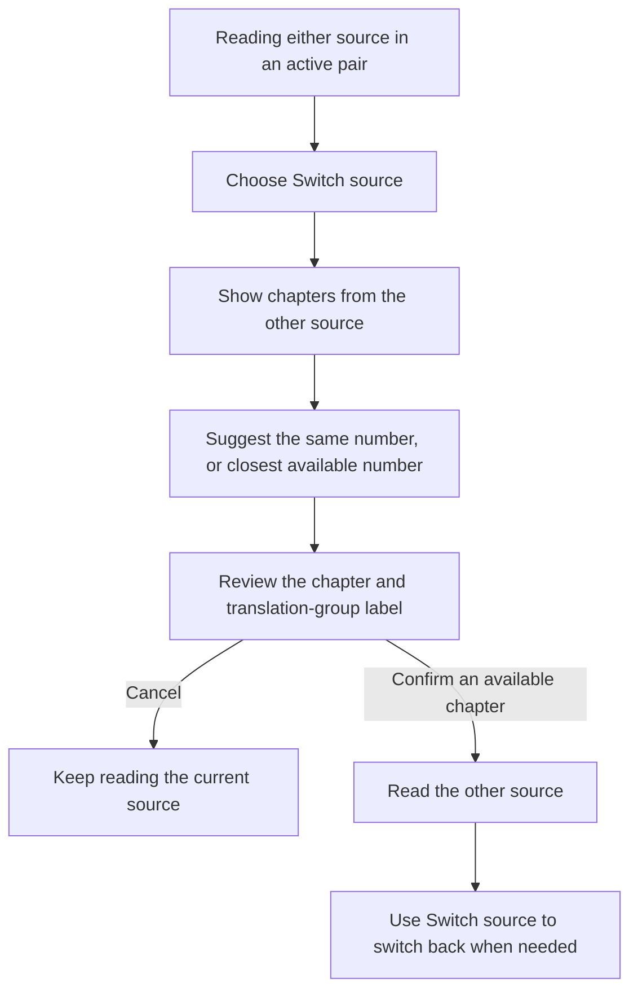

# Reading and chapter navigation

Read chapters, switch between sources, manage optional reading times, and find your last-read position.

## Where you find it

Open the timer from the reader's timer action. Manage the reading schedule from that dialog or **Settings > Reader > Reading schedule**. Completion-rating options are under **Recommendation settings > Versions and quality**; the rating offer appears after leaving the final available chapter when enabled. **Jump to last read** appears in the manga toolbar when the chapter list contains a valid read-position target.

## What changes and what stays familiar

These are optional controls around the normal reader. When they are disabled, ordinary reader behavior stays the same. Schedule and timer messages can be dismissed and do not change chapter progress on their own.

The schedule entry in the reader opens the same choices found under **Settings > Reader**, so there is only one place to manage the schedule. Changes are saved with the app's other settings.

**Reading schedule** lets you choose days and time windows, then either block reading during those windows or allow reading only during them. Enable the schedule to apply it. It affects this app's reader only, not other apps. If an allowed period ends while you are already reading, you can finish that chapter; a new chapter waits until reading is allowed again.

The **manual timer** is separate from the schedule. It counts active reading time rather than time spent with the app in the background. Its finish-current-chapter and extra-chapter choices control what happens when the timer runs out. The extra allowance, when enabled, is for one next chapter reached by normal forward reading, not arbitrary chapter-list jumps. A timer allowance does not override a schedule restriction.

## Page layout and controls

Open **Settings > Reader** to change the default reading mode and its controls. Paged, Webtoon, and Vertical+ sections have their own options; changing a Webtoon gesture does not change the paged reader's gesture setting. Some options are unavailable until a related setting is enabled.

| Setting | What it changes |
| --- | --- |
| Smaller tap zones | Makes the navigation areas smaller in supported tap layouts, leaving more room for opening the reader menu. It does not resize the manga page. |
| Force horizontal seekbar | Uses the horizontal page-position bar instead of the vertical bar. The vertical-bar placement options are unavailable while this is enabled. |
| Show vertical seekbar in landscape | Allows the vertical page-position bar when the screen is sideways, unless the horizontal bar is forced. |
| Left-handed vertical seekbar | Places the vertical page-position bar on the other side. This does not reverse the chapter's reading direction. |
| Wide images zoom mode | Chooses how the paged reader's automatic wide-image zoom works: fit the image height or use double the starting scale. Enable wide-image zoom with a compatible image scale setting first. |
| Disable zoom in | Limits zooming in within the paged reader. Its Double tap zoom option is unavailable while this is enabled. Webtoon has separate gesture controls. |
| Smart scale on wide screen | In the Webtoon reader, choose Fit screen or a target page proportion. On a wide display, a target proportion can narrow the reading area; it does not stretch the artwork or improve the original image resolution. |
| Apply Smart scale to Long strip with gaps | Allows that scaling choice in the continuous vertical mode with gaps as well. It is off by default. |
| Pinch to zoom | Enables or disables two-finger zoom in the Webtoon reader. Double tap zoom is a separate choice. |

For other reader adjustments, use the relevant section:

- **Display** controls rotation, background, fullscreen, keeping the screen awake, and the page number.
- **E-Ink** controls page-change flashes and their duration, interval, and color. These are display choices, not image-quality improvements.
- **Reading** controls skipping already-read, filtered, or duplicate chapters and showing chapter transitions.
- **Paged** and **Webtoon** control tap layouts, page scaling, border cropping, zoom, page transitions, and handling wide or double pages. Splitting double pages and rotating them to fit are alternative choices; enabling either turns the other off.
- **Vertical+** controls page-sized tap scrolling and border cropping for that mode.
- **Navigation** controls volume-key navigation and its direction. **Actions** controls long-press actions and separate manga folders for saved images.
- **Page downloading** controls preloading, simultaneous page downloads, and cache size. These can affect data use and storage; they cannot repair an unavailable source.

Check the page and navigation behavior after changing a setting. A zoom or scaling choice does not replace comparing the actual pages from different sources; see [Versions](versions.md).

### Loading and storage

Under **Settings > Reader > Page downloading**, choose how much the reader loads ahead:

| Setting | What it changes |
| --- | --- |
| Preload amount | Loads nearby pages ahead of your reading position. Larger amounts use more data and temporary storage; they do not guarantee that every page will be ready. |
| Download threads | Chooses how many page downloads can run together. More simultaneous requests can encounter a source's limits. The reader always uses at least one downloader; choosing 0 does not turn downloading off. |
| Reader cache size | Sets the space available for temporary reader images. This is not a chapter-download backup; cached pages can be removed and need loading again. |
| Aggressively load pages | Queues the entire chapter for loading instead of only loading around your current page. It can use data for pages you never reach. |

These choices cannot repair missing pages or an unavailable source. Use ordinary chapter downloads when you want to keep chapters for offline reading.

### Other reader options

The additional reader-options section under **Settings > Reader** contains these choices.

| Setting | What it changes |
| --- | --- |
| Skip queue on retry | Prioritizes retrying the current failed page. It does not retry every failed page immediately or guarantee success. |
| Preserve reading position on read entries | Keeps the saved page position when reopening a chapter already marked read, instead of treating it as a fresh reread. An explicitly requested page still takes priority. |
| Auto Webtoon Mode | Chooses a suitable default mode for manga detected as long-strip format. A reading mode you set for that manga takes priority. |
| Reader Bottom Buttons | Chooses which supported buttons appear along the reader's bottom controls. Hiding a button does not disable its feature. |
| Page layout | Chooses single pages, paired pages, or automatic layout. Splitting double-page images is a different setting and can prevent paired-page display. |
| Invert double pages | Swaps the paired-page ordering where supported. This option is unavailable with single-page layout and does not apply while double-page splitting is enabled. |
| Center margin | Adds space at the center of the selected wide or paired-page layouts, useful when the display has a hinge or an area you want to leave clear. It does not add pages to the chapter. |
| Archive reader mode | Chooses how pages inside chapter archives such as CBZ or CBR are loaded: directly from the file, through memory, or through a temporary disk cache. Memory and storage limits can cause the reader to use a fallback; the chapter contents are not changed. |

## Completion and rating behavior

Under **Recommendation settings > Versions and quality**, **Ask for a rating after finishing** controls the completion offer. **Ask about other versions** controls the later offer to rate other versions after saving a rating. Neither setting chooses a rating for you.

After the final available chapter, the optional completion prompt offers rating choices. Choose **Not now** or press Back to leave without changing your rating. Accepting the offer opens the rating screen, where you can also rate linked versions when available. Your rating changes only when you select one. If you then decline the offer to rate other versions, the rating you already saved stays in place; those other versions are not rated by that dismissal.

## Jump to last read

On manga with long chapter lists, **Jump to last read** scrolls to your saved reading position. It does not mark chapters read, change progress, or open the reader. If there is no saved position, or your current chapter filter hides it, the action is unavailable rather than jumping to an unrelated chapter.

## Switch between sources

An alternate source is another source offering the same manga. The **primary source** here means the one you started reading from, not the version of the app. Switching sources does not automatically add the other manga to your library.

1. Open the reader's alternate-source chooser and select an available manga. If the app asks whether it is the same manga, check the title and confirm only when it is correct. Use **Search installed sources** or **Global search** if you need to find another version.
2. In **Choose the matching chapter**, review the suggested chapter. The first chapter with the same number is selected when available. Otherwise, the closest available number is suggested; if two are equally close, the lower number wins. For example, if you are on chapter 5 and the other source has only 4 and 6, it suggests 4.
3. Check the chapter name and translation-group label when supplied by the source. Several translations may have the same chapter number. You can select a different entry before confirming.
4. While that source pair is active, use **Switch source** in the reader to choose a chapter from the other source. After returning to the primary source, the same action lets you switch back to the alternate source; returning is not the end of the pair.

The suggested chapter number is not a guarantee that the contents match. Some sources split chapters or start numbering at a different point. If the app warns that the match is uncertain, check the pages before continuing. **Correct chapter mapping** lets you change which chapters correspond; **This chapter is not the match** keeps the current chapter open while you choose another match. If you have read ahead and the other source lacks that chapter, choose a suitable chapter from its list instead.

This shortcut depends on an active reading pair and available chapters. If the session ends or cannot be restored, open the alternate-source chooser again rather than expecting the old pair to remain available. Reading-time restrictions still apply when switching sources. See [Versions](versions.md) for comparing page quality and choosing a preferred version, and [Local tracking](local-tracking.md) for sharing progress across linked manga.

## Chapter reading sequence

If a page does not load, check its error message. Opening an alternate source is a separate choice, not an automatic replacement for every failed page.

## Completion preference

The prompt appears after leaving the reader, not over the final page. Declining the offer does not change your rating; selecting a rating does.

## Reader settings flow

These optional controls add to the existing reader settings and viewer without replacing them.

## Reading schedule

Switching sources does not bypass a schedule restriction. The schedule is off by default; the manual timer has its own separate choices.

## Jump to last read

Jump to last read changes only the list position. It does not open a chapter or modify reading history.

The schedule and timer remain optional. **Jump to last read** appears only when a valid last-read position exists, and using it only moves the chapter list.

## Switching a source pair

If the pages do not correspond, correct the chapter match rather than assuming matching numbers mean matching content.
