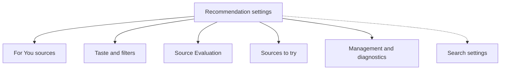
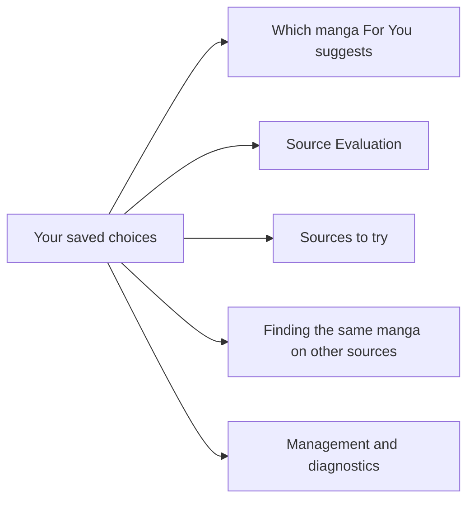
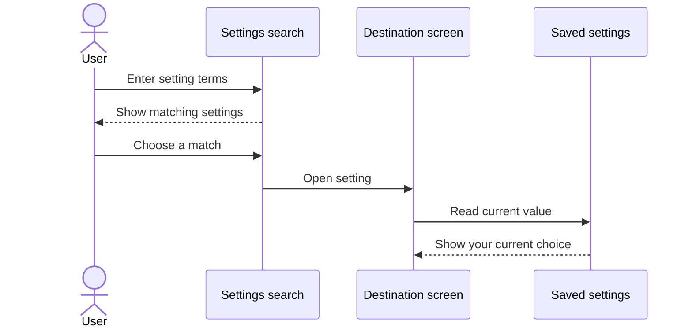
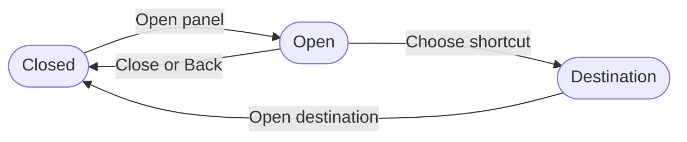

# Configuring personalized recommendations

Recommendation settings use the same lists, sections, search, and navigation patterns as the rest of Komikku.

## Where you find it

Open For You and select its settings action. The layout adapts to your screen size; on a larger screen, the same destinations may appear in a quick-access panel. Choose **For You sources**, **Taste and filters**, [**Source Evaluation**](source-evaluation.md), [**Sources to try**](sources.md), or **Management and diagnostics**.

## How the settings are organized

Settings are grouped under clear headings. Each row opens the place where you can change that choice, and Settings search can find a setting by its name or summary. Longer explanations appear beside the control when they are useful.

| Section | Main decisions |
| --- | --- |
| For You sources | Enabled sources, source order, recent discovery, repeat-display controls, and a saved For You preview. |
| Taste and filters | Ratings, hidden manga, preferred or blocked genres and tags, and minimum chapter count. |
| Source Evaluation | Evaluation limits, reassessment, and quality results. |
| Sources to try | Discovery suggestions and supported installation handoff. |
| Management and diagnostics | Recommendation languages, result limits, linked-version behavior, comparison previews, extra-page searches, discovery history, saved Focus modes, and diagnostic summaries. |

Number settings are checked before the app uses them. **Minimum chapter count** applies to For You recommendations and recent discoveries when the app knows a manga's chapter count.

## Choose how much there is to read

In **Taste and filters**, set **Minimum chapter count** to a number from 0 to 50. **0** means **Off**, so there is no minimum; choosing 1 to 50 hides manga with a known count below your choice. This changes recommendations, not your library or saved reading progress.

The app may not yet know how many chapters a newly discovered manga has. Those manga can still appear, as can manga whose chapter-count lookup failed. The setting does not guarantee that every suggested manga has the requested number of chapters. Lower the number or turn it off if too few results remain.

The number beside a source's **Great fit** badge describes its earlier contribution history, not how many manga must appear now. The current **Shown** count describes the latest refresh after filters and duplicate handling. See [Source Evaluation](source-evaluation.md).

## Control familiar manga and tags

In **Taste and filters**, choose whether to hide disliked manga, hide all rated manga, or show all rated manga. **Hide manga you already know** is a separate switch: it excludes manga you have rated, added to your library, or started reading. Showing rated manga does not override that separate switch.

Add a genre or tag as **Preferred** to favor matching manga, or **Blocked** to exclude matches. You can edit or delete your saved choices. Taste suggestions come from your rated manga; adding one saves it as preferred or blocked only when you choose that action. A suggestion is not a setting already applied for you.

## Choose result and search limits

These controls are in **Management and diagnostics**. A limit is not a promise that the source will return that many suitable manga.

| Setting | What it changes |
| --- | --- |
| Results per source | Limits the manga cards shown in each For You source row. It does not turn off your manga filters. |
| Results shown first per source | Sets the initial number displayed for each source in group recommendations. Open a source to see more. This is separate from the For You row limit. |
| Extra details per source | Limits how many results receive additional manga details before ordering. More detail can help ordering, but takes additional time and source requests. |
| Search more pages | Off checks only the first page; Standard checks one additional page per source; Extended can check up to three additional pages. More searching can use more data and take longer. |
| Extra results to check | Limits extra manga checked on additional pages. A value of 0 turns off that extra checking. Raising it does not guarantee more manga will pass your filters. |

## Manage remembered choices

In **Management and diagnostics**, **Reset For You discovery history** clears remembered discoveries and their search-page progress. Confirm the reset, then refresh For You to discover again from the beginning. This does not clear your ratings, seen-manga history, or source settings.

Saved **Focus modes** can be renamed, deleted, and moved up or down here. They are the same modes used by For You's Focus control, not a separate set of settings. Deleting a saved mode does not delete manga from your library.

**Quality signal history** opens the recorded quality information. Taste and source-tag diagnostic sections help explain the information the app has collected; they are not proof that every title has complete or correct metadata.

## Choose how linked manga behave

A linked version is the same manga available from another source. It is not a software update or a different version of the app. These controls are in **Management and diagnostics** and can also be found through settings search.

| Setting | What it lets you choose |
| --- | --- |
| Results per source, under Versions and quality | Show 1 to 10 possible matches from each source when finding other versions of a manga. This is separate from the For You result limit and does not change normal search. |
| Select matches by default | Start with all possible matches selected, none selected, or exact title matches selected. Check the results yourself before confirming; similar titles are not proof that the manga is the same. |
| Use top-right rating actions | Put rating actions in the top-right menu instead of directly on each rated manga card. This changes where you act, not the saved rating. |
| Ask for a rating after finishing | Offer to rate the manga after you finish its latest available chapter. Declining does not change your rating. |
| Ask about other versions | After rating a manga, offer to apply the rating to versions on other sources. Cancelling the follow-up keeps the original rating you saved. |
| Rate linked versions together | Also give your rating to linked versions from other sources that you track. Leave this off to rate versions separately. |
| Track linked versions together | Starting local tracking on one version can also start it on linked versions. This is separate from updating outside tracker accounts. |
| Choose reading status automatically | Use chapter progress to choose Plan to read, Reading, or Completed. On hold and Dropped remain choices you can make yourself. |
| Choose a primary version automatically | When you have not chosen a version yourself, use the most-read linked version for the group's cover and title; equal read counts prefer the earlier rating. Your explicit choice takes precedence. |
| Review same-manga matches | Check which versions are confirmed as the same manga and which matches were rejected or still need review. |

See [Ratings](ratings.md) for group actions and [Local tracking](local-tracking.md) for chapter progress, refresh, and stopping progress sharing with one version.

## Choose comparison previews

Under **Management and diagnostics**, **Best version preview pages** sets how many sample pages appear for each source. More samples give you more to compare, but require more image loading. **Avoid first pages in preview** skips the first one or two pages when choosing samples, which can avoid credits, covers, and advertisements.

These settings change the small comparison samples, not the chapter itself. **View in Reader** opens the selected full chapter even when thumbnail previews fail. Press Back to return to the comparison. See [Comparing versions](versions.md).

## Expected interaction behavior

When you change a setting, it is saved automatically. Return to For You and refresh when prompted so the page can use the new choice. Back navigation, themes, languages, and accessibility work the same way as in the rest of the app.

## Navigation map

The five visual sections group related controls and keep the first page short enough to scan. **Search settings** is a separate way to jump directly to a control; it is not a sixth section.

## Settings affect features

Values are checked before use. Invalid stored numbers fall back to safe limits instead of reaching feature policies unchanged.

## Search for a setting

Search results explain both the setting and the section that contains it.

## Quick-access panel

On larger screens, the quick-access panel provides the same destinations as the settings list. Close it with **Back** or by choosing a destination.
