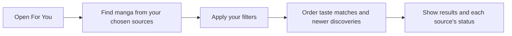
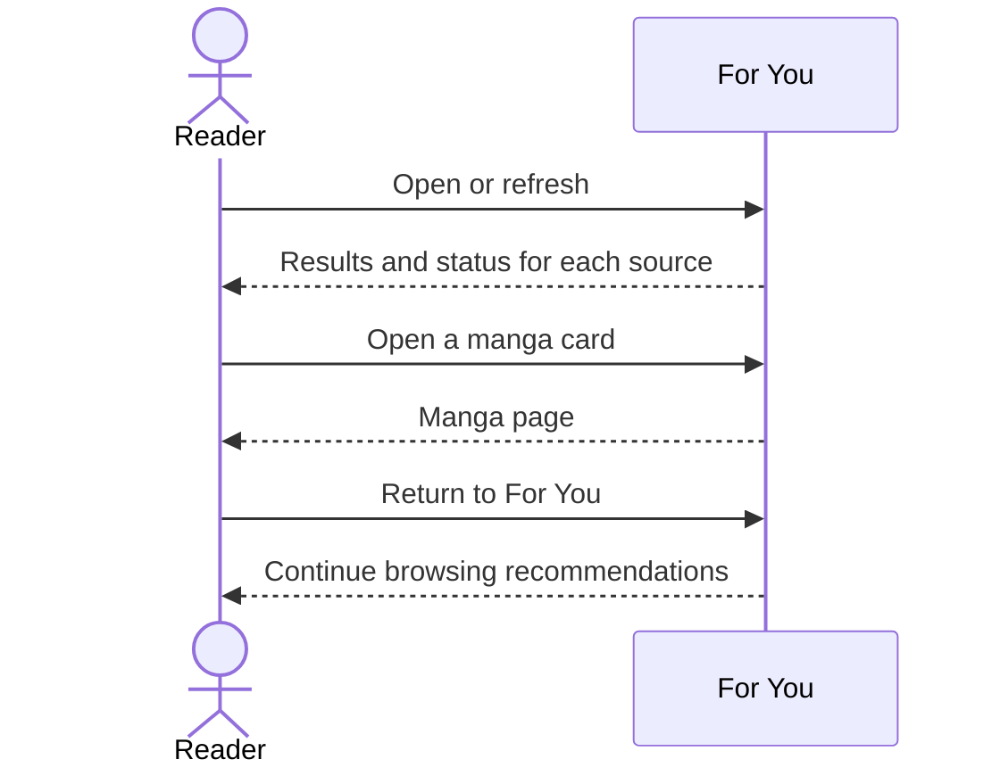
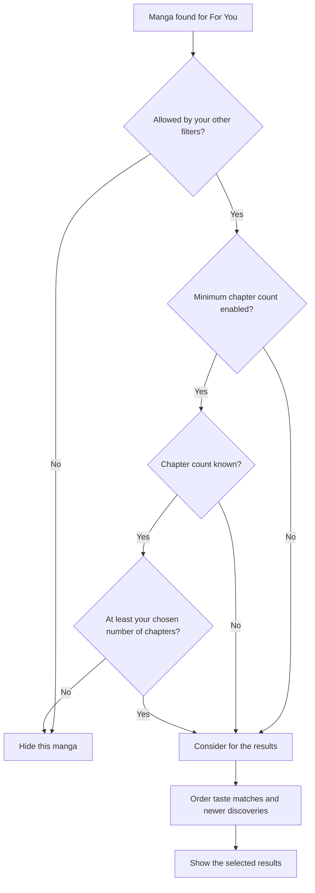
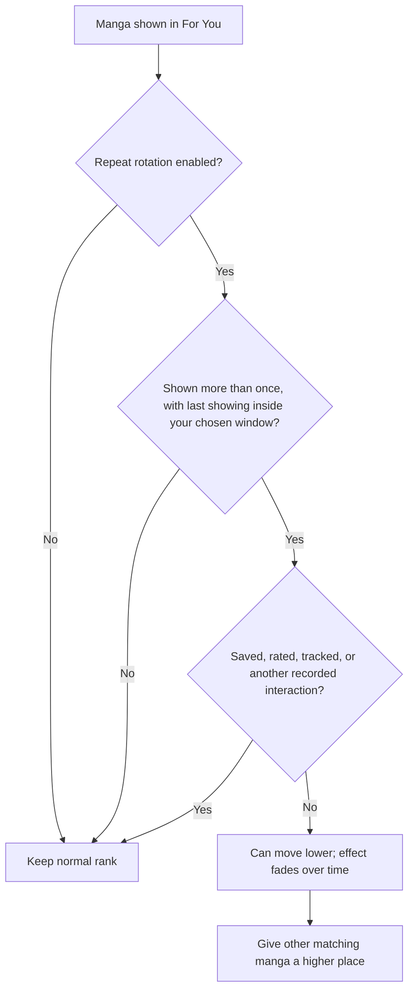

# Personalized recommendations and discovery

For You suggests manga from your chosen installed sources. It combines matches for your taste with newer discoveries, applies your filters, and can move repeatedly shown manga lower when the app has no recorded interaction with them.

## Where you find it

Open **Browse**, then select **For You**. The page contains topic shortcuts followed by recommendation rows for the sources that are eligible under the current settings.

## What For You is designed to do

For You is not a single popularity list. It gathers manga from your chosen sources, applies your filters, and combines matches for your taste with newer discoveries. Personalized results remain the majority when enough are available. Newer discoveries still use your blocked genres, languages, and source rules. The minimum chapter count hides manga below your choice when a count is known; manga whose chapter list has not loaded can still appear. See [Recommendation settings](recommendation-settings.md) for that limitation.

When repeat rotation is enabled, the page remembers manga shown in recent results. A manga shown more than once within your chosen time window can move lower instead of disappearing. That effect fades as the last showing gets older and ends when it falls outside the window. Manga saved in your library, rated, tracked, or with another recorded interaction are exempt. The app does not treat a lack of interaction as a dislike.

## What you see on the page

- Topic shortcuts provide fast entry points into broad recommendation groups.
- Each source row shows its own results, loading status, or explanation when results are unavailable.
- Manga cards retain the normal Komikku interaction model: opening a result leads to its manga page rather than performing a hidden preference write.
- Evaluation Mode can hide source labels in screenshots. It does not change which manga are recommended or hide every personal detail. See [Sharing](sharing.md).

The order can change as new results arrive and previously shown manga move lower. Your filters still apply.

## Top Picks, selection, and sharing

Top Picks combines the strongest currently available matches into a focused list without removing the per-source rows that explain where broader discovery came from. Use a card's selection action to enter selection mode; on a touch screen, this may be a press-and-hold gesture. The selection bar can apply a preference or clear one across the chosen manga, while single-item actions can open the manga or continue into [version comparison](versions.md).

Top Picks, an individual source row, or a rated collection can also be exported as a recommendation bundle to share. Import opens a review screen first. Check the manga and source matches before adding anything to your library. Entries that cannot be matched or read are identified rather than silently added as another manga. See [Sharing](sharing.md).

## Recommendations from a group

Rated and linked-version groups can start a recommendation search using the whole group rather than one manga alone. Results appear source by source, and the preview-size setting controls how many appear at first. Leaving the page stops unfinished work; a slow or failing source affects its own row rather than the whole result.

## Feature overview

One unavailable source does not prevent other sources from showing results.

## Retrieval and display

Each source is handled independently. One failing source can produce a row-level explanation without discarding successful rows.

## Candidate eligibility

This diagram describes **For You**, not every recommendation search. An unknown chapter count does not hide a manga, and being considered does not guarantee a visible place: only a limited number of results are shown. Newer discoveries use the same For You filters.

## Exposure-aware refresh

Moving a manga lower changes its position only. It does not delete the manga or remove your library entry, rating, or tracking.

The page keeps personalized results, recent discoveries, filters, and source status separate so the result remains understandable and predictable.
