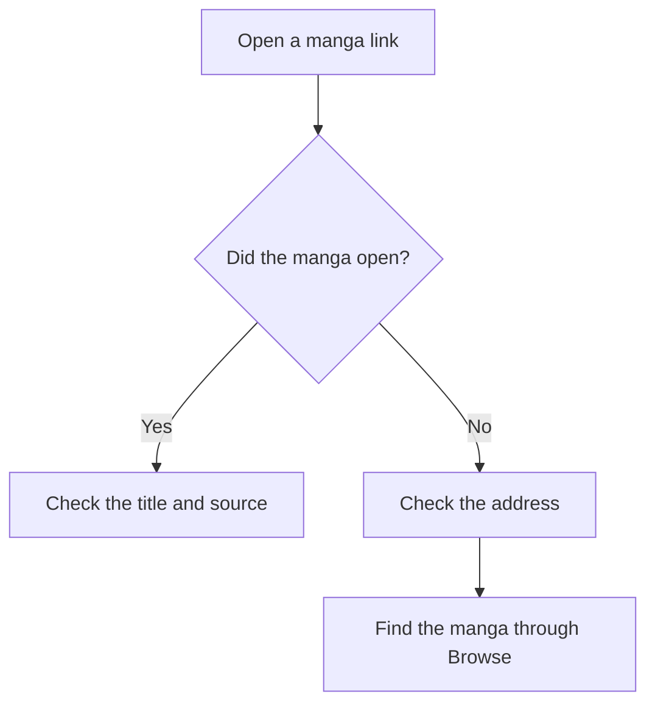
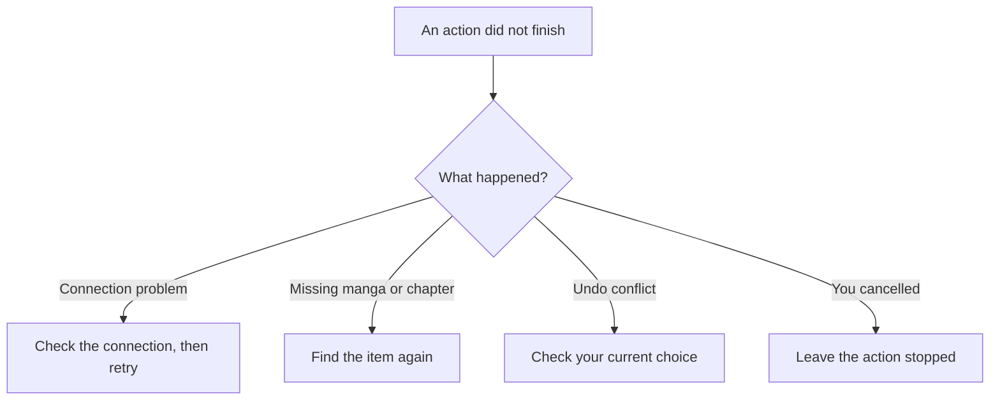
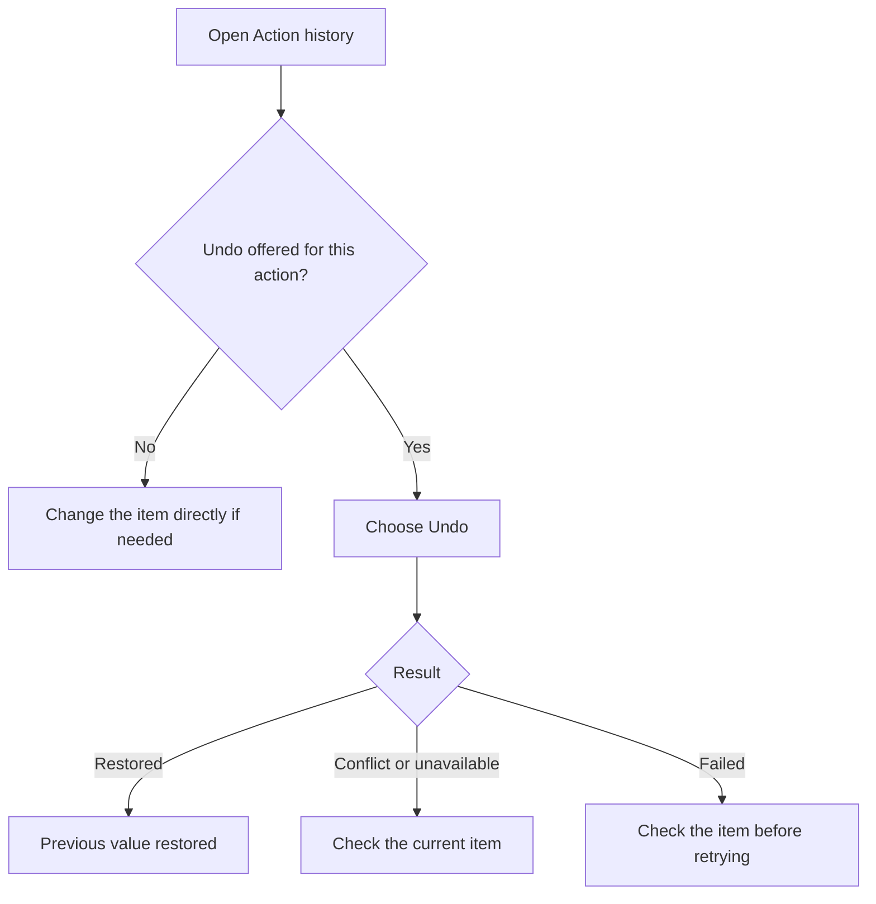
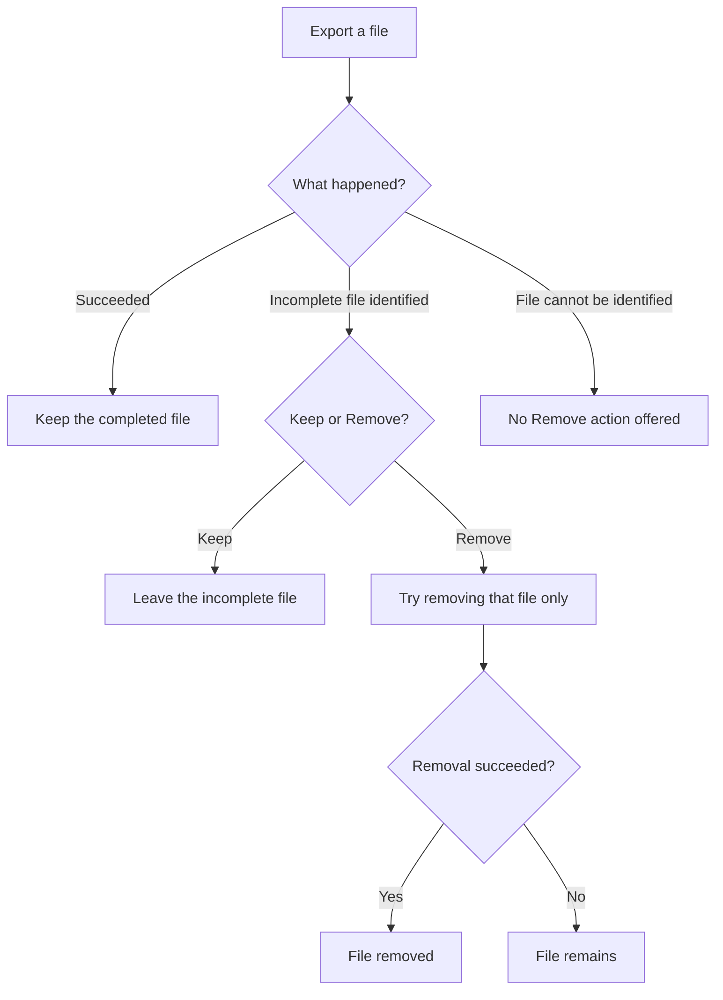

# Links, Undo, and file safety

Komikku FC can open manga links, undo supported local changes, and help remove an incomplete export. These are different actions: Undo is not a backup, and checking a link does not prove that its website or extension is trustworthy.

## Opening links

Only open links and install extensions from places you trust. If a link is rejected or cannot open, check the address and try finding the manga through Browse instead. Do not keep retrying an unfamiliar address just to make it open.

A source can be unavailable even when its address is correct. [Source Evaluation](source-evaluation.md) checks how a source works with the app; it is not a security check of that source.

## When an action fails

Read the message for the action that failed. A temporary connection problem may be worth retrying. A rejected link, missing manga, or conflicting Undo needs a different next step.

Cancelling does not necessarily reverse work already completed. For example, an interrupted restore may have restored some items. See [Backups](backups.md) and [Troubleshooting](troubleshooting.md) for the relevant recovery steps.

## Undoing supported changes

Open **More > Settings > Advanced > Action history** to review recorded actions. Use **Undo** when it is offered for the change you want to reverse. Not every action is reversible.

Undo checks the value affected by that action before restoring it. If that value no longer matches what the action saved, Undo can report a conflict instead of replacing your current choice. Check the current setting or manga state and make the change directly if needed.

Undoing a chapter's read or bookmark change does not undo reading history or tracker progress. Keep a [backup](backups.md) for recovery across installations; do not rely on Action history as a complete record of your library.

## Incomplete exports

A successful export is kept. If an export fails or is interrupted after the app has identified the file it created, it can offer **Keep** or **Remove** for that file. Remove targets that file only, not its folder.

The app cannot safely remove an export it cannot identify. A failed removal leaves the file in place. Development builds can also offer removal of a successful extension export for testing; that is not the normal public-build behavior.

Before sending a file, screenshot, or log to someone else, check it for manga titles, recognized page text, links, account details, and other information you do not want to share. Evaluation mode does not hide everything and does not anonymize exported data. See [Sharing](sharing.md) for what it changes.

To report a security concern, follow the [security policy](../../../SECURITY.md).
