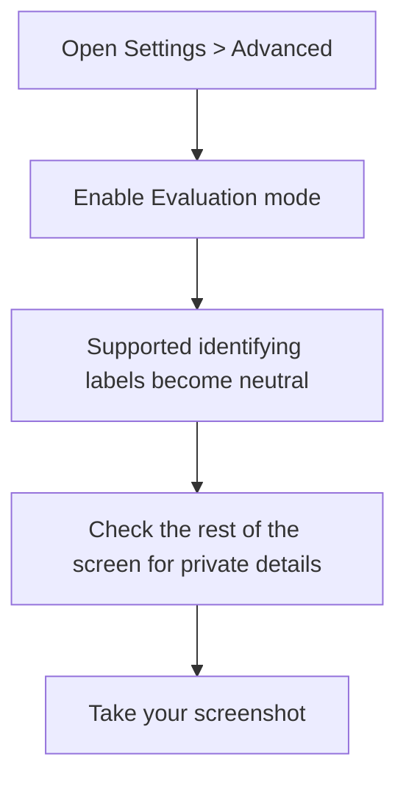
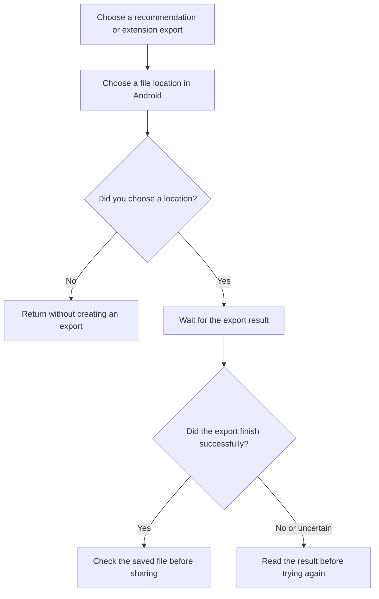
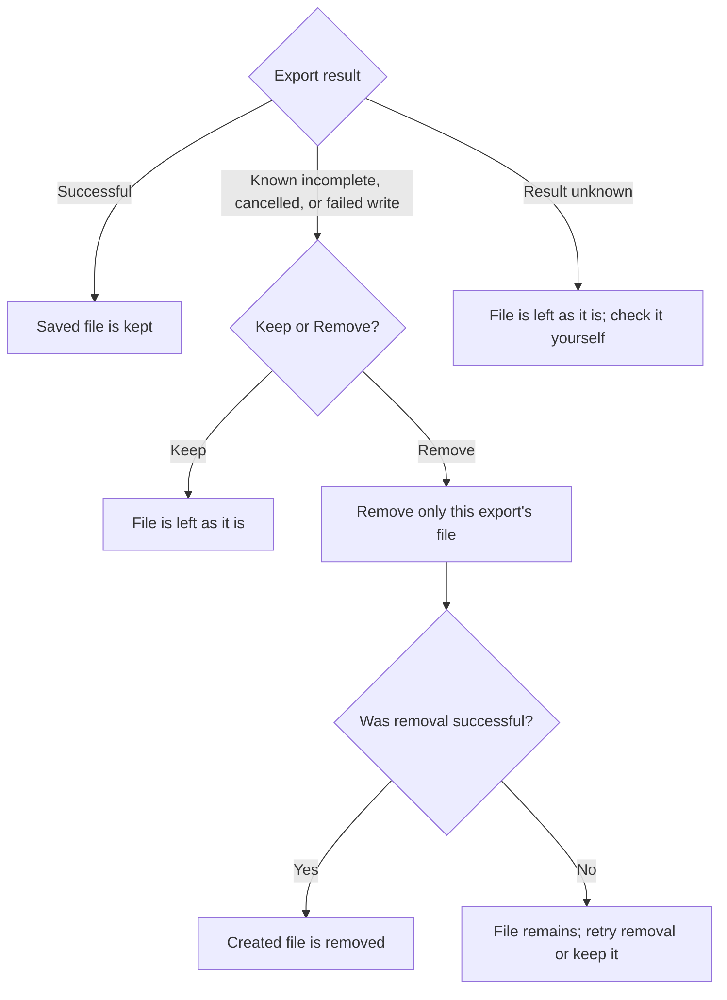
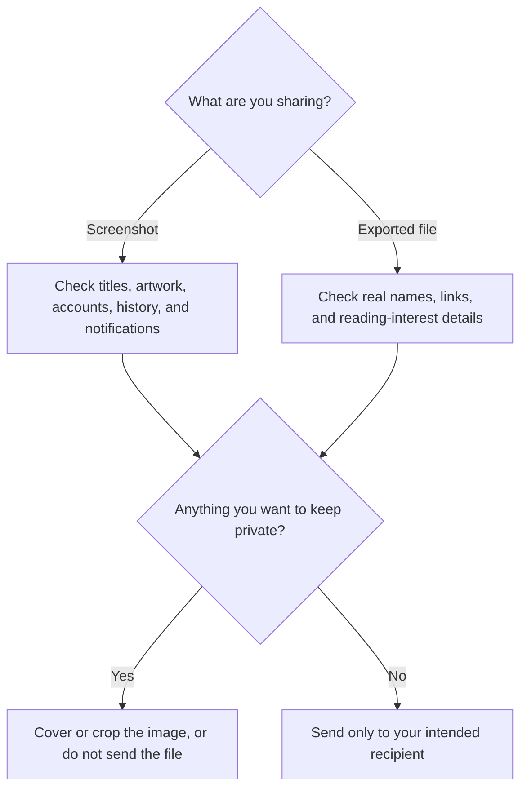

# Sharing screenshots and files safely

You can share recommendation lists, export installed extensions, or take screenshots. Check what each contains before sending it to someone else.

## Hide labels in screenshots

Open **Settings > Advanced** and enable **Evaluation mode**. Supported source, extension, repository, and preference-tag labels become neutral labels. These labels can change after restarting the app.

This changes only supported labels on screen. Your saved manga, source connections, and actions stay the same. Manga titles, artwork, reader pages, ratings, reading history, account names, notifications, and Android controls are not hidden automatically.

## Share a recommendation list

Use the export action in **For You** or **Top Picks**, then choose where Android should save the file. Someone importing it can review the recommendations; opening the file alone does not add its manga to their library.

**Evaluation mode does not hide information inside exported files.** Recommendation files can contain real manga titles and links, source and extension names, repository names, cover links, descriptions, genres, recommendation scores, and the preference groups that matched. These details can reveal your reading interests, even without account information.

An extension export contains the selected installed extension package, or an archive of selected packages. It is not a backup of your library, ratings, reading history, or tracker accounts. Share only extensions you trust and have permission to distribute.

## If an export fails

A successful export is kept at the location you chose. Normal exports do not offer to remove a successfully saved file.

Android can create the destination file before the export finishes. If the app knows that the write failed, was interrupted, or left an incomplete file, it can offer **Keep** or **Remove** for that file. Remove targets only the file created by this export, not older files with similar names or other files in the folder.

If the app cannot confirm whether the export finished, it leaves the file as it is and explains that the result is unknown. Check it yourself before sharing or retrying. If removal fails, the file remains; you can retry removal or keep it.

## Check before sending

For screenshots, inspect the whole image, including the status bar and notifications. Crop or cover information you do not want to share. For exported files, check their contents separately: neutral screen labels do not make the files anonymous.

Evaluation mode is a screenshot aid, not a privacy guarantee. Check each image or file yourself.
