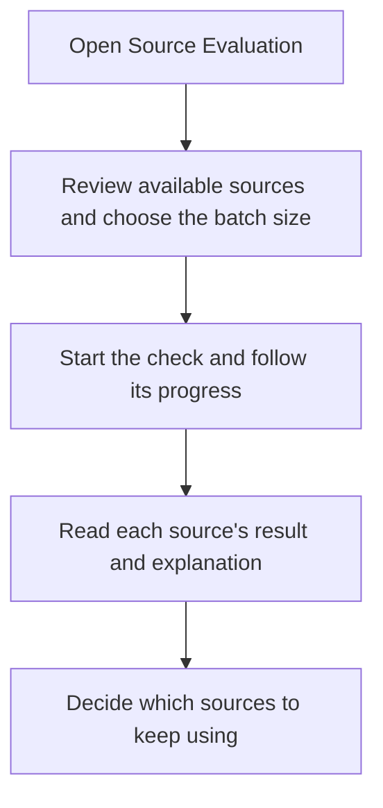
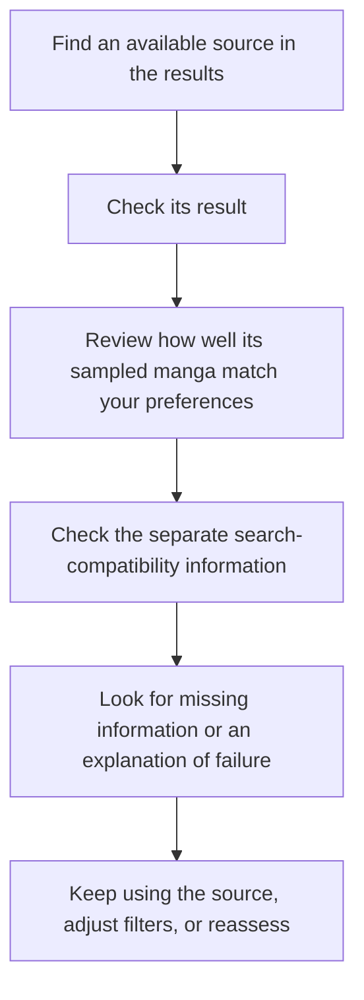
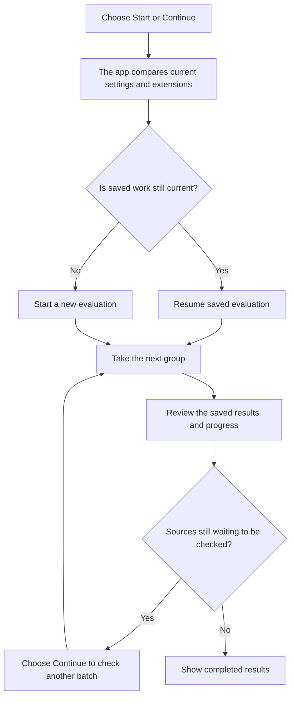
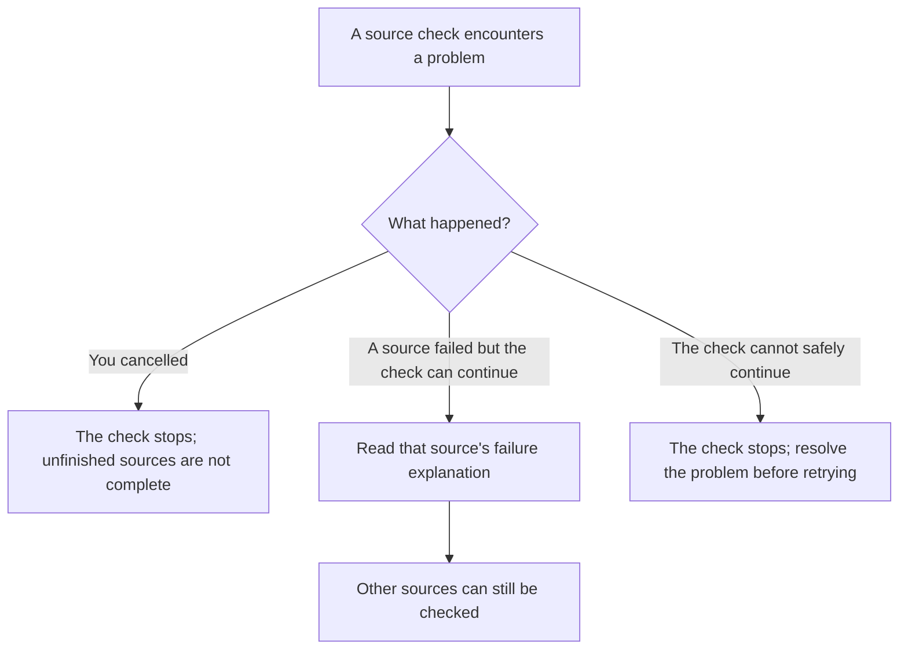
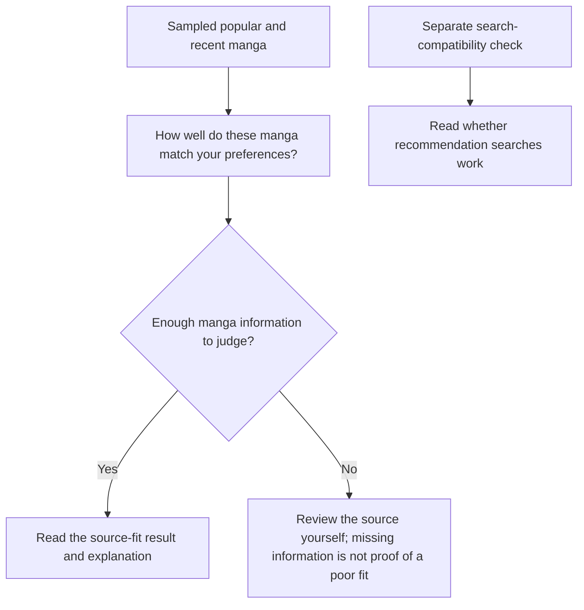

# Evaluating recommendation source quality

Source Evaluation checks whether a source can provide useful recommendations. It saves a short result and explanation instead of showing raw errors. Some checks temporarily install an extension and attempt to remove it afterwards, so read the installation and cleanup warnings before starting.

## Where you find it

Open **Recommendation settings**, then select **Source Evaluation**. The screen shows readiness, progress, completed results, and actions to continue or reassess when the inputs have changed.

## What an evaluation means

An evaluation samples a source's popular and recent manga and compares their available details with your preferences. Search compatibility is checked separately. It is not a permanent judgment about the source, a complete inspection of its catalogue, or a promise about how many recommendations you will see.

## Before starting a check

Choose how many sources to check in one batch. Expand the setup options to decide whether to skip already evaluated sources and whether to include explicit sources. Including explicit sources in a check does not mean you want every explicit manga recommended.

Review the installer and cleanup section. The installer selected here applies to this evaluation, not your general extension-installation preference. Some installation methods require Android confirmation prompts or additional setup. If the installer is unavailable, resolve the screen's warning before starting.

Read and accept the pre-run warning when requested. A check can install, contact, and attempt to uninstall extensions. Cleanup can require confirmation or fail; review any remaining-extension message rather than assuming everything was removed. Do not start another extension-checking job while this one is running.

The saved result shows how well the source fits, how much information supports that result, when it was checked, and a short explanation. When relevant preferences or installed extensions change, an old result may need reassessment. A source providing too little information needs your review; that alone does not mean its manga are a poor match.

## Progress and result states

| State | Meaning | Available action |
| --- | --- | --- |
| Ready | Available sources have not yet been checked with these settings. | Start a check. |
| Running | The current queue is being processed and progress is saved. | Leave the screen or cancel. |
| Partial | Some sources completed while others were skipped or failed. | Review the explanations and continue checking the remaining sources. |
| Completed | The selected queue reached a result. | Reassess when inputs change. |
| Failed | The operation itself could not continue. | Retry after the stated condition changes. |

Leaving the screen does not mark unfinished checks as complete. Continue uses saved progress when it still matches your current settings and installed extensions.

## Why Great fit can show only a few manga

The source-fit badge summarizes earlier For You refreshes. **Great fit** means the source has often supplied useful matches; it is not a promise that every refresh will show the same number of manga.

The Top Picks count records how often the source contributed to that row. The current **Shown** count reports matches visible after the latest refresh, including your filters and duplicate handling. These counts measure different things. A source can have a strong history and show only one match today.

If too few manga appear, check your minimum chapter count, blocked tags, languages, and other recommendation filters. Compare the source's current explanation with its history before excluding it. See [Recommendation settings](recommendation-settings.md).

## Taste and source-quality diagnostics

Management and diagnostics also shows your rating counts, suggestions based on repeated ratings, how much manga information a source provides, and its past results. A suggestion needs support from more than one rated manga; one rating does not automatically create a rule for an entire genre.

Source-quality marks describe the source's collection, not your opinion of one manga. Use source actions to change those marks; see [Sources](sources.md) for their location and effects. Showing quality-marked results on the evaluation page does not remove the marks. These choices are separate from rating manga. The check is not a security audit or a guarantee that an extension is safe to install.

## Show and sort past results

Use the past-results controls to show or hide installed sources and sources with quality marks. Showing a hidden result does not clear its quality mark, install an extension, or enable recommendations from it.

Sort by Best fit, Newest, Source name, Extension name, For You compatibility, or Explicit risk. Sorting changes the list order; it does not run another evaluation or change a saved result.

**Clear all** beside past results asks for confirmation before clearing saved Source Evaluation results. It does not uninstall the extensions. Check the outcome before assuming the clear succeeded.

## Understand the management resets

Expand **Management** to find these actions. Each requests confirmation. Cancel the confirmation if you want to keep the saved information.

| Action | What it clears or resets |
| --- | --- |
| Reset disliked sources | Clears saved recommendation dislikes for sources. Other filters, quality marks, and disabled-source choices can still exclude them. |
| Reset reassessment baseline | Resets the remembered rating count and time used to suggest reassessment. It does not erase your manga ratings or perform a new evaluation. |
| Clear seen manga | Clears manga marked Not interested. Despite the label, this is not a reset of chapter read marks or general reading history. Check those manga's ratings afterwards if the operation was interrupted. |
| Clear dismissed suggestions | Makes dismissed Sources to Try suggestions eligible again when their other conditions allow them. It does not install them. |
| Clear disliked suggestion sources | Clears the same saved source-dislike list used by Reset disliked sources, including dislikes that can affect installed-source recommendations. It does not clear quality marks or dismissals. |

Some actions appear only when there is information to clear. None of these actions repairs an unavailable source or guarantees that new recommendations will appear. For the separate discovery-history reset and its scope, see [Recommendation settings](recommendation-settings.md).

## Diagnostics and recovery

When no evaluation job is active, open **Diagnostics and recovery**. **View warning** shows the installation and cleanup warning again without starting a check.

**Copy Diagnostics** puts a short report on your clipboard; it does not send it anywhere. The report includes the app version, time, evaluation options, counts, current job stage, and Shizuku setup status. Source and extension names can appear when Evaluation mode is off. Evaluation mode replaces those names with generic labels. This report uses error categories rather than raw errors and does not include extension package names or signature hashes. Read the copied text before sharing it; this does not describe the contents of other logs or screenshots.

If a source-loading warning appears, open **Details**. The available actions depend on the problem:

| Action | What it does |
| --- | --- |
| Retry | Forgets the temporary failure recorded for this source so the next request can try again. It does not update or repair the extension. |
| Update | Requests an available update for an installed extension. Follow any Android installation prompts and check the outcome. |
| Reinstall | Requests installation of the extension version currently available. This is not a promise that the failure will be fixed. |
| Uninstall | Requests removal of the installed extension. Check Extensions afterwards to confirm removal. |
| Disable | Asks for confirmation before saving a block against loading that extension again. It does not uninstall it or remove your manga. |

Not every problem offers every action. Retry does not remove the separate saved safety restrictions described below.

## Quarantined and blocked extensions

Expand **Safety diagnostics** when it appears, then select the quarantined or blocked count to see its list. These lists describe different restrictions:

- **Quarantined Extensions** were set aside after a suspected fatal crash during evaluation. Future evaluations skip them, but quarantine does not uninstall them or prevent their use elsewhere in the app. Remove a crashing installed extension from Extensions rather than assuming this list protects ordinary browsing and reading.
- **Blocked Extensions** have a saved restriction against loading their code in the app. An installed extension remains installed until you uninstall it from Extensions or Android Settings.

In the quarantined list, **Remove** clears one saved quarantine entry; it does not uninstall the extension. **Clear quarantine** asks for confirmation before clearing the saved quarantine list. Only retry a previously crashing extension if you have reason to believe the problem has changed.

In the blocked list, **Allow again** appears for entries that can be removed. It clears that extension's saved load restriction. **Allow all** asks for confirmation before clearing saved load restrictions. Neither action installs an extension, removes evaluation quarantine, or proves that an extension is now safe. Restrictions built into the app are separate and cannot be removed by clearing these saved lists. A newer-version notice is a reason to investigate an update, not proof that the crash has been fixed.

Check the lists after a clear or allow action. If a previously crashing extension is still installed, allowing it again can cause another crash. Cancel a confirmation to keep the restrictions.

## Evaluation overview

The app checks the selected batch size at a time. Leaving the screen does not cancel a running batch, but checking another batch requires the continue action. This is not a guarantee that Android will keep the job alive after the app or device is stopped.

## Evaluate one source

Catalogue quality and recommendation-search compatibility are separate signals. A source can succeed at one and fail at the other.

## Continue or reassess

Changing filters or installed extensions does not silently mix old and new evaluation assumptions.

## Failure isolation

Recoverable failures remain local to one source. Cancellation is never converted into a successful result.

## From checks to a result

Catalogue fit and search compatibility answer different questions. A source can offer manga you like even when its searches are unreliable. Neither result guarantees that every manga will appear after your current filters are applied.
