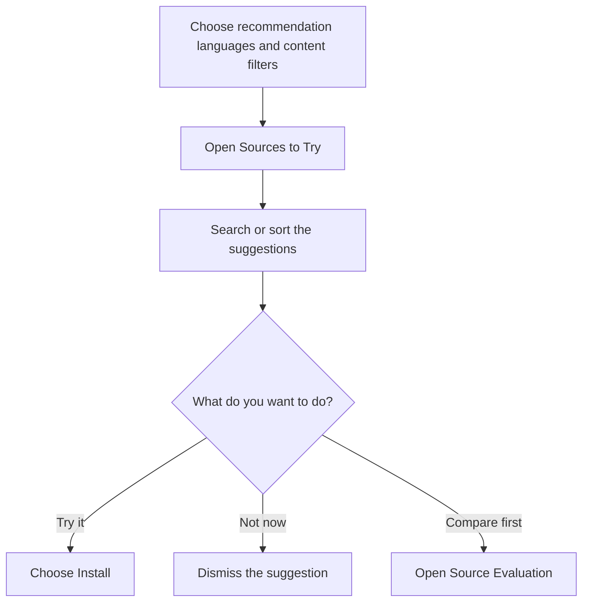
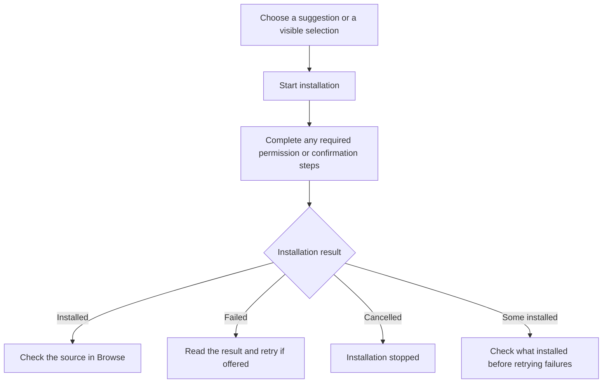
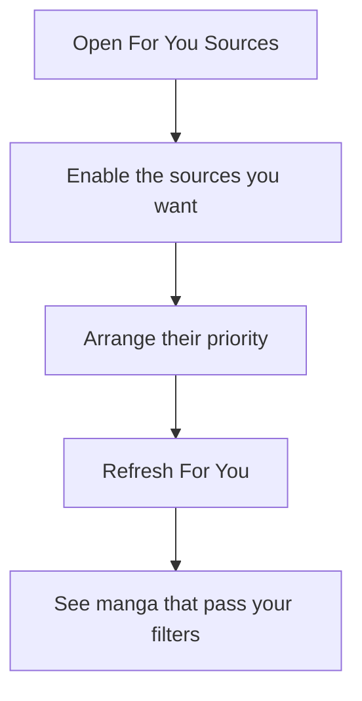
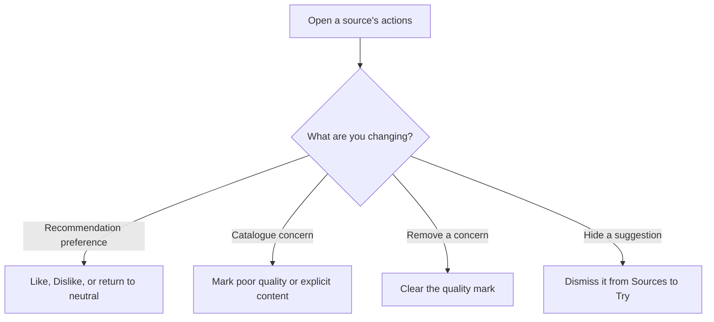

# Find and choose recommendation sources

A source is a website or service whose manga you can browse through an installed extension. **Sources to Try** suggests extensions you have not installed. **For You Sources** controls which installed sources contribute recommendations and their priority.

Open **Recommendation settings**, then choose **Sources to Try** or **For You Sources**.

## Find a source to try

Suggestions use your recommendation languages, content filters, source preferences, and available information about the source. Already-installed and untrusted extensions are not suggested. Dismissed, disliked, and poor-quality-marked suggestions are also excluded.

A suggestion is not proof that a source works well or is safe. Some suggestions come from similarities to sources you already use and still need testing. Saved Source Evaluation results can help order the list; missing results do not mean that the source passed an evaluation.

Use the search field to find a name, language, or repository. Search filters the suggestions already available; it does not search every manga website. Sort by **Best fit**, **Name A-Z**, or **Language**. Best fit is a recommendation order, not a security rating.

When the list is shortened, use **Show more** to see the remaining suggestions. If a search finds nothing, clear the search. If there are no suggestions at all, check your languages, filters, repositories, and dismissed suggestions.

## Install deliberately

Use a suggestion's **Install** action, **Install visible**, or **Select** followed by **Install selected**. Bulk installation applies to the visible or selected suggestions, not every available extension.

Installation follows your configured extension installation method. Complete any permission or confirmation steps it requires. The app reports success only after the installation flow reports the extension installed.

Cancellation does not uninstall extensions that already installed. A failed or cancelled attempt can offer Retry; check the result rather than assuming every selected extension was installed.

After installation, use [Source Evaluation](source-evaluation.md) to check suitability and **For You Sources** to check whether the source is enabled for recommendations. Installation alone does not guarantee useful matches. See [Extensions](extensions.md) for installation methods, trust, and removal.

## Set the priority of installed sources

In **For You Sources**, use the source switch to include or exclude it from recommendations. Reorder rows by dragging or using the move actions. You can reset the order, or apply a fit-based suggested order when that action is available.

A higher-priority source is considered earlier. It does not bypass your manga filters or guarantee more results. A source can have a strong fit rating but show few manga after chapter, taste, or other filters. Fit and the number currently shown describe different things.

The page also contains exploration and repeat-display controls. See [Recommendation settings](recommendation-settings.md) and [Recommendations](recommendations.md) for their effects. The For You preview shows a saved recommendation snapshot; it is not a live source check.

## Keep preference and quality separate

**Like** and **Dislike** describe whether you want recommendations from a source. Quality marks describe a problem with that source's catalogue, such as poor quality or explicit content. They are separate choices; clearing one does not necessarily clear the other.

In Sources to Try, **Clear dismissed suggestions** makes dismissed items eligible to appear again if their other conditions still allow them. It does not install them. **Clear all quality marks**, when offered, clears saved quality marks; it does not clear every dislike, dismissal, or disabled-source choice.

Changing a preference does not remove an extension or erase manga already in your library. Content marks and filters cannot guarantee that every explicit title will be detected.

For information you should check before sharing a screenshot or export, see [Sharing](sharing.md).
