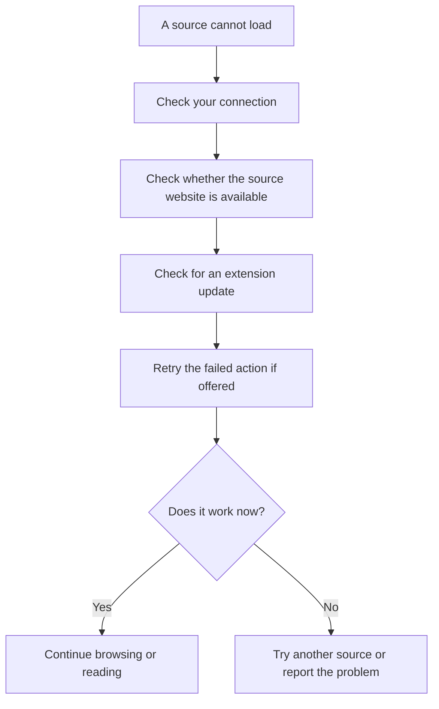
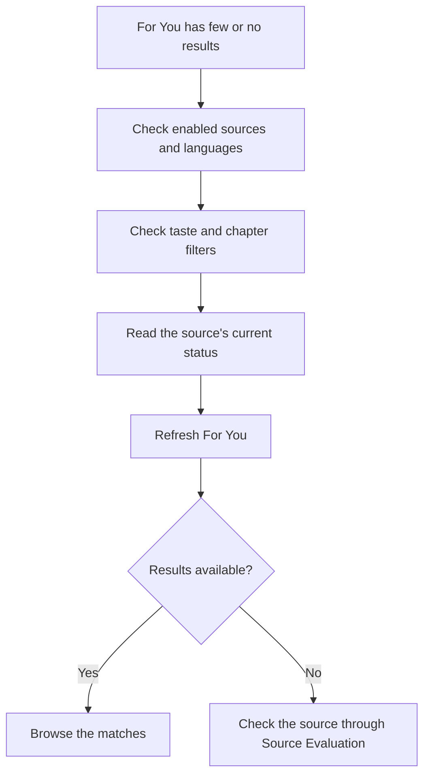
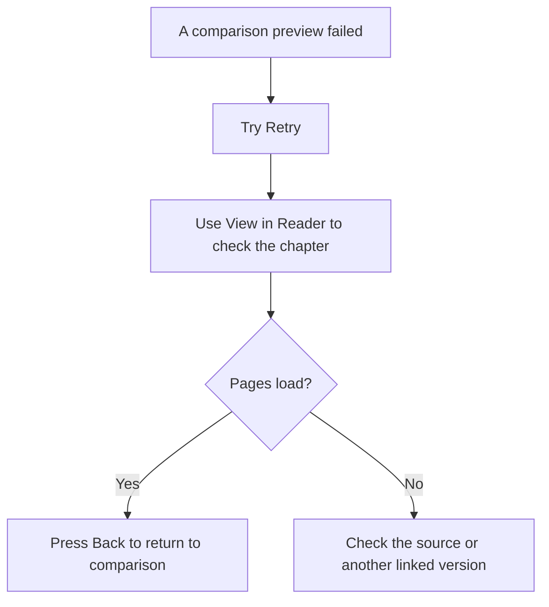
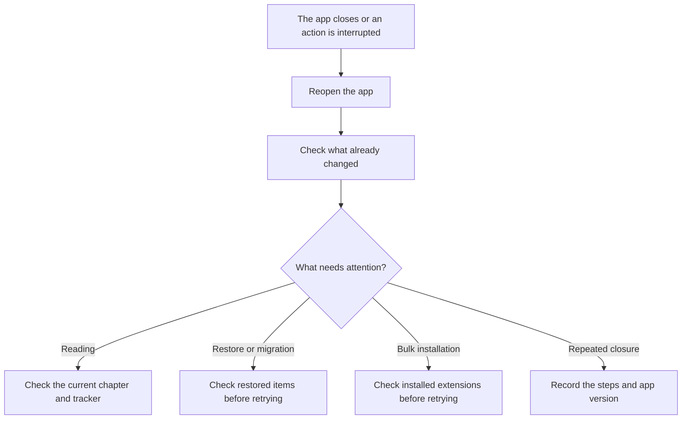

# Troubleshooting sources and reading

Start with the action that failed and the message on that page. A source is the website or service used by an extension. One source may fail while another still works; this does not mean your library is lost.

## A source cannot load

Check your connection, then check whether the source's website is available. If an extension update is available, read its details before updating. Retry the failed action when the page offers it.

The app temporarily avoids repeated calls to a recently failed source. This does not uninstall or permanently disable the extension. A retry can still fail if the underlying problem has not changed.

Source Evaluation has a separate restriction for extensions associated with a detected crash during evaluation. A normal connection failure and an evaluation crash restriction are not the same thing. Follow the message on the evaluation page rather than repeatedly forcing the source to run.

## For You shows few or no manga

Open **Recommendation settings > For You Sources** and check which sources are enabled. Check your recommendation languages and the filters in **Taste and Filters**, including the minimum chapter count.

A strong source-fit rating does not guarantee many visible recommendations. Fit describes the source's usefulness; shown results also depend on your manga filters and what the source returned.

Do not assume that an empty list proves the source has no manga. See [Recommendations](recommendations.md), [Recommendation settings](recommendation-settings.md), and [Sources](sources.md) for the controls that affect this list.

In Sources to Try, clear a search that finds nothing before changing your settings. Also check dismissed suggestions, dislikes, content filters, languages, and repository availability.

## Preview or reader pages fail

In **Find Best Version**, use **Retry** when a preview fails. **View in Reader** provides another way to open the selected chapter even if preview images failed; it still needs the chapter to be available. Press Back to return to the comparison page.

A working preview does not guarantee that every chapter will load, and View in Reader cannot repair a missing chapter or unavailable source. Reading there can update normal reading progress.

If alternate-source switching cannot find the matching chapter, check the chapter list and its scanlator or release-group labels. Choose the appropriate chapter instead of assuming different sources number every chapter identically. See [Reading](reading.md) and [Compare versions](versions.md).

For downloaded-page text searches, check that the pages are still downloaded and process those pages again if old results no longer open. See [Search downloaded pages](ocr.md).

## The app closes or an action stops partway through

A recoverable source error may leave other results available, but not every crash can be caught. If the app closes, reopen it and inspect the current state before repeating a restore, migration, or bulk installation. Some work may already have completed.

For a repeatable problem, include the app version from **More > About > Version**, the steps taken, the expected result, and what happened. A screenshot or crash log can help, but a crash report may not be available for every closure.

Check screenshots and logs before sharing: logs can contain source names and technical details, and screenshots can expose manga titles or account information. Evaluation mode does not anonymize everything. See [Sharing](sharing.md) and the repository's [issue tracker](https://github.com/FancyCorey/komikku-fc/issues).

For interrupted restores and supported Undo actions, see [Backups](backups.md) and [Links, Undo, and file safety](safety.md). Cancellation is not a promise that all completed work was reversed.
