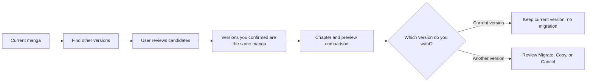
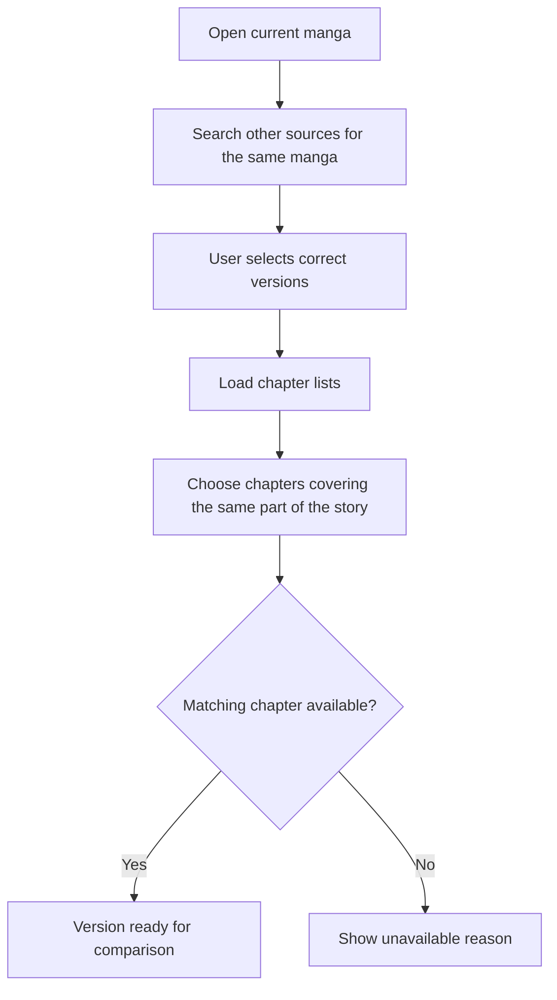
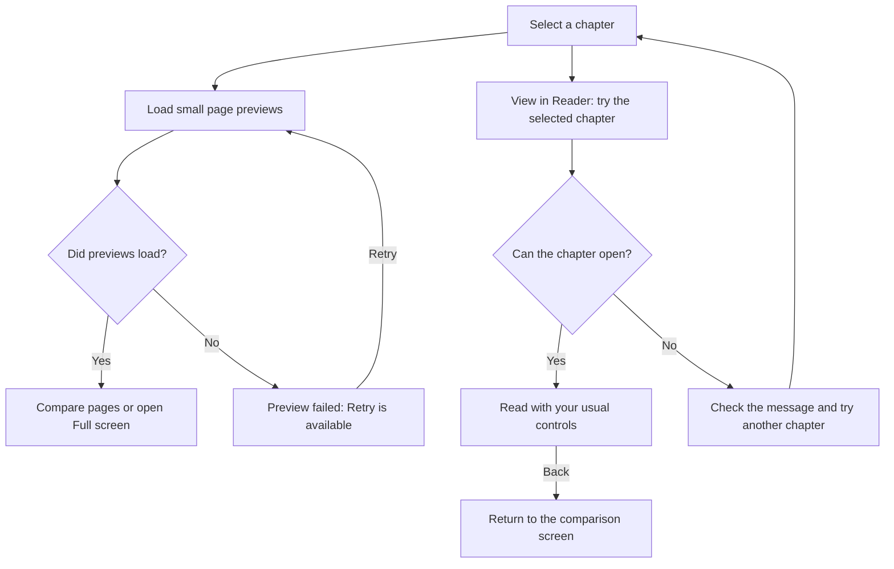
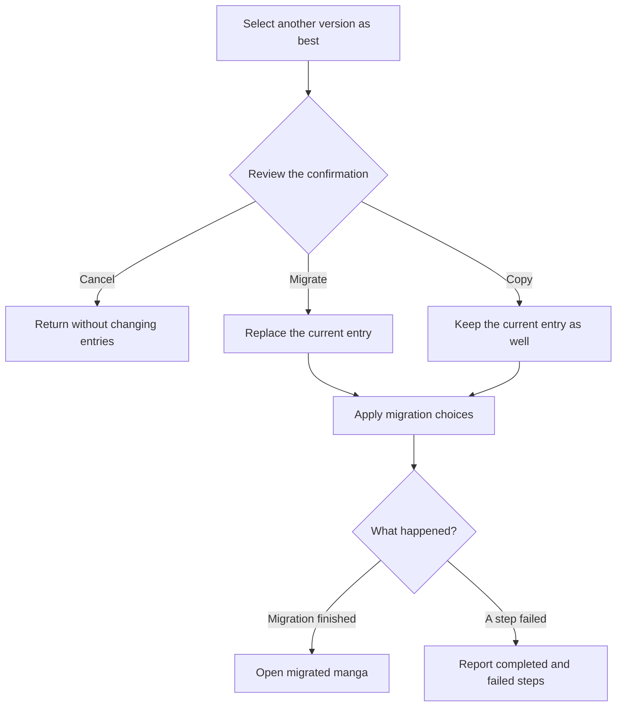

# Finding and comparing manga versions

Komikku FC can find the same manga on other sources, let the reader confirm which results are genuinely related, and compare chapter availability and page previews before any migration begins. Matching and comparison are deliberately separate from migration: reviewing another version never changes the library by itself.

## Where you find it

Open a manga and choose **Find other versions** from its actions. Confirm which results are the same manga. **Find Best Version** lets you compare their chapters and pages before choosing whether to replace your library entry.

## What the workflow helps you decide

The matching screen answers “are these the same manga?” The Best Version screen answers “which confirmed version is more useful to me?” Keeping those questions separate prevents a search result from becoming trusted merely because its title looks similar. The reader can inspect candidates, reject mismatches, compare chapter samples, retry an individual preview, and keep the current version without starting migration.

| Step | Reader decision | What changes |
| --- | --- | --- |
| Find other versions | Select only genuine matches | Confirmed links are saved; the library entry is unchanged. |
| Choose chapters | Pick comparable samples when automatic matching is insufficient | Comparison state changes; no manga is migrated. |
| Review previews | Compare availability and page rendering | Preview results are temporary and independent per source. |
| Keep current version | Stay with the version you already use | No migration starts. |
| Select as best version | Review the confirmation and choose Migrate, Copy, or Cancel | Migrate replaces the current entry; Copy keeps it as well; Cancel leaves both unchanged. |

## What the comparison looks like

| Chapter selection | Preview comparison |
| --- | --- |
|  |  |

With Evaluation Mode enabled, source names appear as neutral labels. Chapter choices and page previews work the same way.

## Read a chapter before choosing

Choose **View in Reader** on the current version or another version to open its selected chapter in the full reader. This action is available even when the small previews fail. You can check text size, image clarity, page order, and scrolling using your usual reader controls.

Press **Back** to return to the comparison screen. Opening the reader does not select a best version or start migration. It is ordinary reading, so reading a chapter can update your saved reading progress.

If the chapter cannot be found or the source cannot load it, the app explains the problem. Try another chapter or retry the source; a failed thumbnail alone does not mean that the full reader will fail.

## Matching and comparison overview

The user confirms matches before they become linked versions.

## Prepare comparable versions

A missing chapter or preview is displayed as unavailable; it is not treated as a failed migration.

Automatic chapter matching helps you find a starting point; it does not guarantee that two translations divide the story into the same chapters. When numbering or availability differs, choose a chapter that covers the same part of the story. A failure from one source does not stop you comparing the others.

## Check pages or open the reader

Each linked version tracks its own preview. If one preview fails, the other comparisons remain visible.

## Migration result

**Keep current version** finishes the comparison without starting migration. Selecting another version opens a confirmation: **Migrate** replaces your current entry, **Copy** keeps the current entry as well, and **Cancel** returns without applying either choice. Read the warning before proceeding: migration cannot be automatically undone and can affect downloaded chapters or connected tracker accounts.

If a migration step fails, check the result before trying again. Some changes may already have finished; a failure does not mean that everything was put back as it was.

## Data, privacy, and recovery

Back up your library before replacing entries. Supported backups can include the links between versions and your preferred version for a linked group. Small page previews are not downloaded chapters for offline reading. Evaluation Mode hides source names on screen without changing which manga you compare or choose. A backup cannot undo changes made to a connected tracker account.

Komikku FC handles finding, linking, and comparing versions. If you choose another version, Komikku then takes you through its normal library-migration steps.
