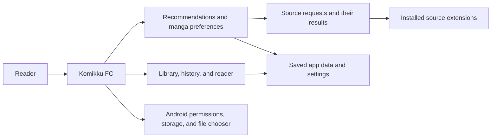
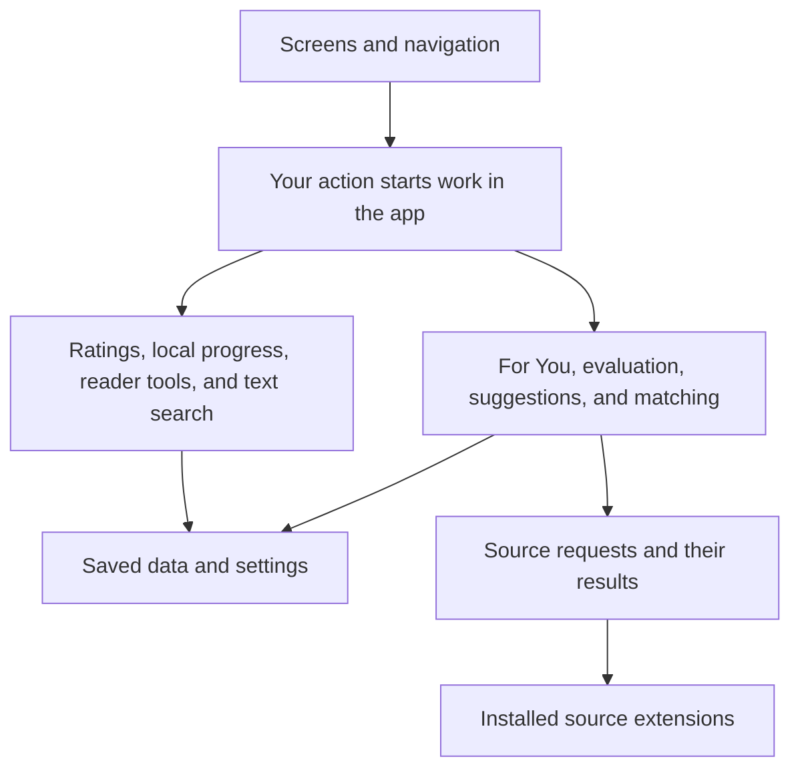
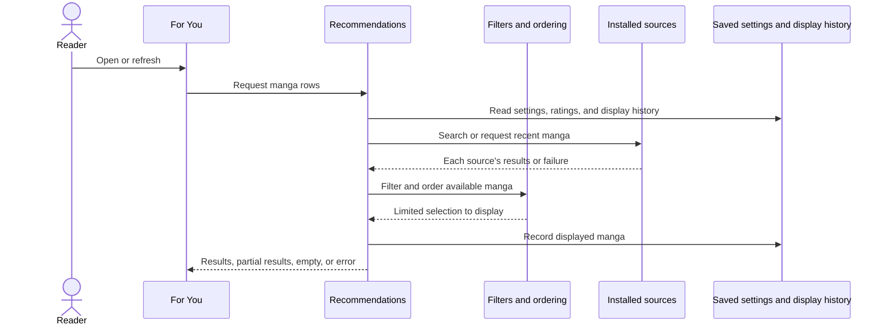
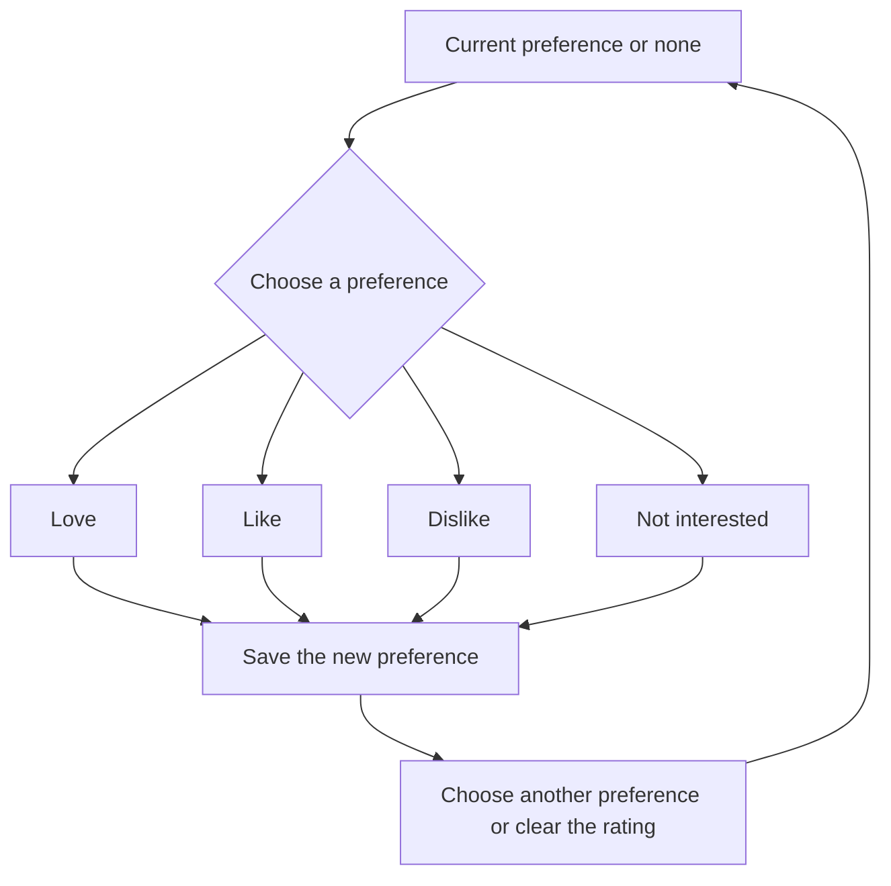
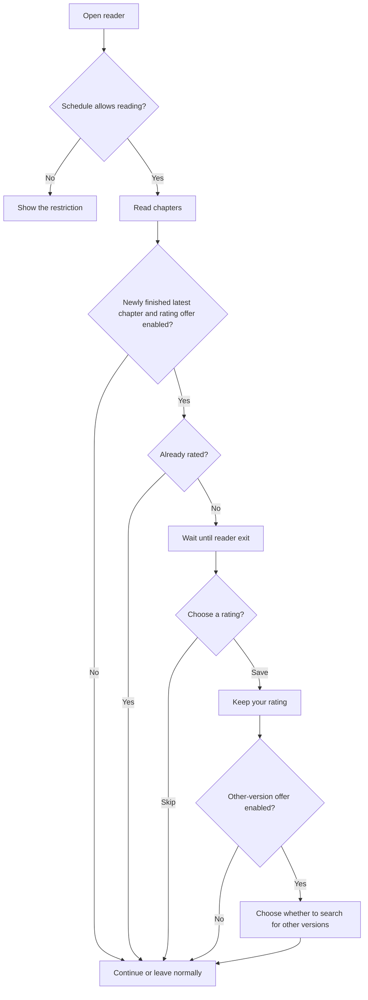
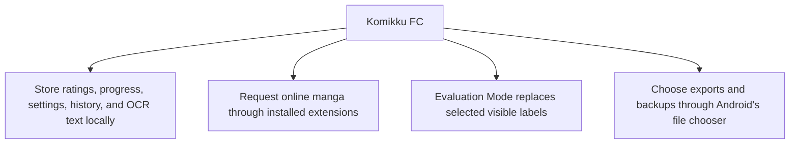

# How Komikku FC works

This page explains how recommendations, reading, sources, and saved data fit together. For step-by-step instructions, use the [user guide](user-guide.md). For settings and limitations, use the [feature guides](feature-guides/README.md). Contributors can find implementation files in the [feature and code map](feature-and-code-map.md).

## System boundary

Komikku FC builds on Komikku's navigation, library, reader, downloads, tracking, backups, and extension support. Its added tools work within those familiar screens, including Local Tracking and source comparison. Installed extensions can access online services; Komikku FC does not add a separate recommendation server.

## Where features live

Some tools use saved data; catalogue searches also contact installed source extensions. Supported source failures keep separate results, so one unsuccessful source need not erase useful results from another. This does not guarantee that every extension crash can be contained. Cancelling pending work does not reverse completed installations, exports, or outside tracker updates.

## Recommendation flow

Personalized matches remain the majority when enough suitable results exist. Recent catalogue entries can add variety but use the same For You filters. The minimum chapter setting hides manga below your choice when a count is known; an unknown count can still appear. Passing filters does not guarantee a displayed place because each row has a result limit.

With repeat rotation enabled, manga shown more than once within your chosen display-history window can move lower. The effect fades over time. Library, rated, tracked, and other recorded interactions are exempt when that state is available. Moving a card lower changes ordering only, not your saved manga. See [Recommendations](feature-guides/recommendations.md) for the full flow.

## Manga preferences

Love, Like, Dislike, and Not interested are choices you can change or clear. Each has a marker and collection. Supported successful changes can appear in Action History with an Undo action. Undo checks the current value before restoring the previous one; it is not a backup or a way to undo every outside tracker update. See [Ratings](feature-guides/ratings.md).

## Reading and completion

The schedule is optional and off by default. The reader checks it when it opens and returns to the foreground. If a restriction begins while reading, the grace message explains whether you may finish the current chapter; switching chapters cannot bypass the restriction. The manual reading timer has separate settings.

The completion offer requires a newly finished latest chapter, an unrated manga, and **Ask for a rating after finishing**. It waits until you leave the reader. **Ask about other versions** controls the separate follow-up; cancelling that offer keeps the rating you already saved. See [Reading](feature-guides/reading.md) for timer, schedule, prompt, and navigation settings.

An active source pair lets you switch in either direction through **Switch source**. Chapter suggestions use matching numbers or the closest available number, not a guarantee that the contents match. Local Tracking applies saved progress when a manga opens or refreshes and can share progress across participating confirmed versions. Source switching and progress sharing are separate tools; see [Local tracking](feature-guides/local-tracking.md).

## Privacy and saved data

Komikku FC does not add a separate recommendation account or server. Installed extensions still handle their online catalogue requests, and connected external trackers have separate update settings.

Evaluation Mode changes selected visible labels, not saved identifiers, requests, or actions. Titles, artwork, reading context, genre suggestions, and counts can remain visible. Inspect the whole screen before sharing it.

OCR text can be rebuilt from downloaded pages, so it is excluded from backup and sync. Clearing the index does not delete those pages. Backups can include ratings, settings, linked versions, and local tracking when their separate options are selected. Sensitive settings are optional; protect any backup you share. See [Privacy and data](privacy-and-data.md) and [Backups](feature-guides/backups.md).
