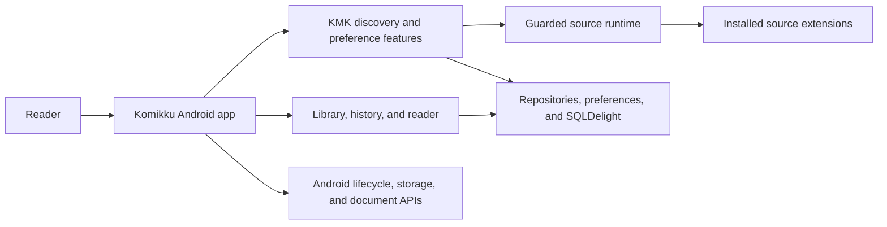
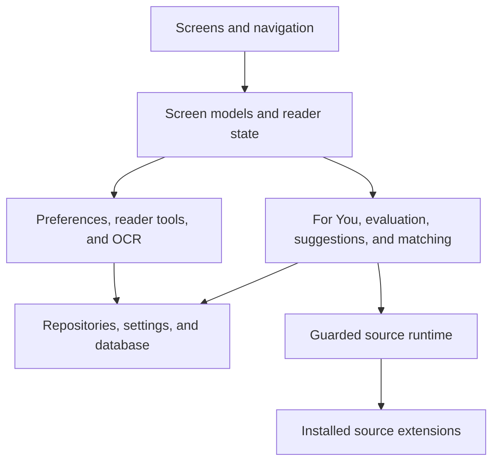
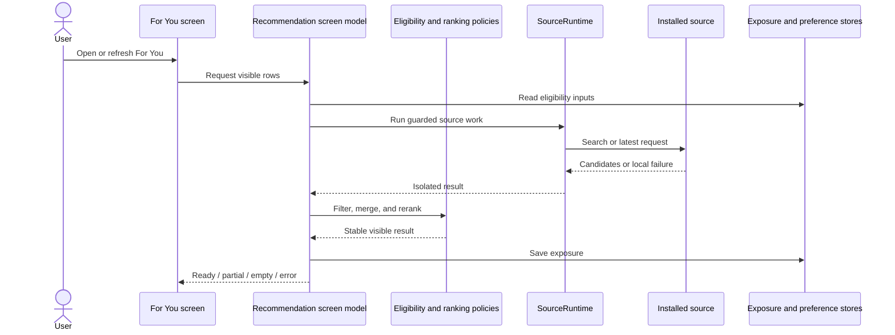
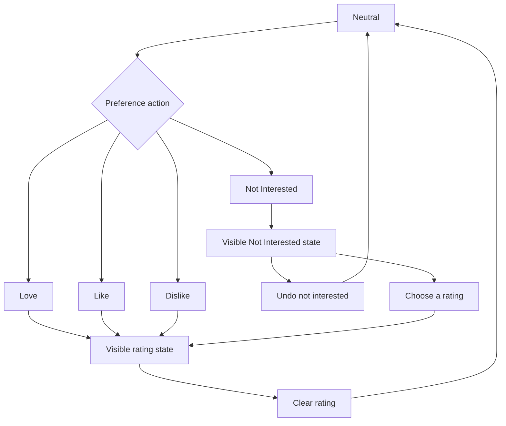
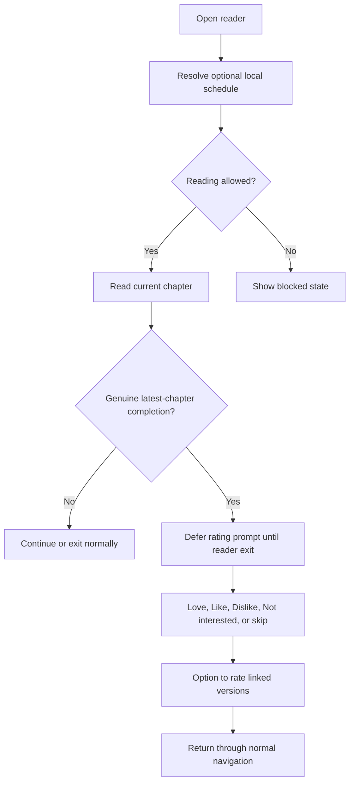
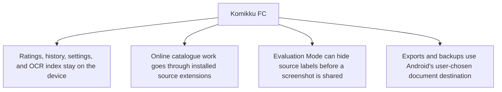

# How Komikku FC works

This page explains how Komikku FC fits into Komikku. Read it when you want to understand which part of the app owns a feature, where data is stored, or how failures are contained. For instructions, use the [user guide](user-guide.md). For a closer look at one feature, use the [feature guides](feature-guides/README.md).

## System boundary

Komikku continues to own navigation, the library, the reader, downloads, tracking, backup, and extension loading. Komikku FC adds discovery and preference features inside those existing parts of the app. Installed extensions can access their own online services; Komikku FC does not add a separate server.

## Where features live

Screens display information and handle navigation. Screen models hold the current feature state and coordinate the work behind each screen. `SourceRuntime` prevents one failing extension from breaking unrelated work and preserves cancellation. Data is stored through Komikku's repositories, settings, and database migrations.

## Recommendation flow

Personalized matches remain the majority when enough suitable results exist. A smaller set of recent catalogue entries can add variety, but those entries must still pass language, genre, minimum-chapter, exclusion, and source checks. If a card remains visible and untouched for the configured number of days, the app moves it lower instead of deleting it. Manga in the library, manga with a preference, and known tracked manga keep their position when the app can verify that state safely.

## Reversible preference actions

Not Interested behaves like the other preference choices. It has its own marker and collection, and it can be cleared or replaced by Love, Like, or Dislike. Before a supported change, Action History records the previous value. It keeps that record only when the change succeeds, so the previous state can be restored unless a newer change would be overwritten.

## Reader lifecycle

The schedule is local, optional, and off by default. The reader checks it when it opens and whenever the app returns to the foreground. Moving to another chapter cannot bypass a restriction. The completion prompt appears only after you finish the latest available chapter, and it waits until you exit so it does not interrupt reading. The manga toolbar also shows **Jump to last read** when a valid reading position exists.

## Privacy and data boundaries

Komikku FC does not add a separate account or recommendation server. Ratings, recommendation settings, reading history, Action History, and the OCR index are stored locally. Installed source extensions still handle their own online catalogue requests.

Evaluation Mode changes visible source labels without changing saved identifiers, requests, or actions. OCR text can be rebuilt from downloaded pages, so it is left out of backup and sync and can be cleared without deleting those pages. Backups can include Komikku FC data that is harder to recreate, such as ratings, recommendation settings, linked versions, and source evaluations.
